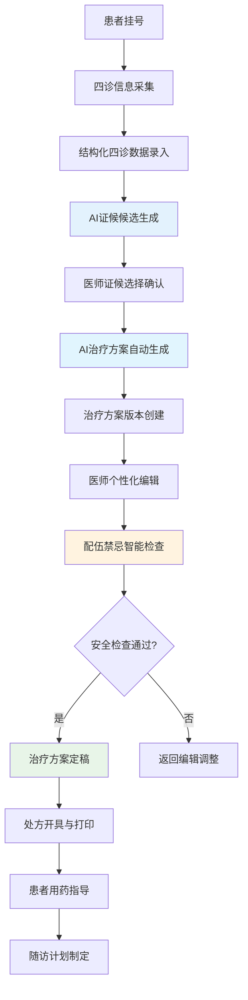
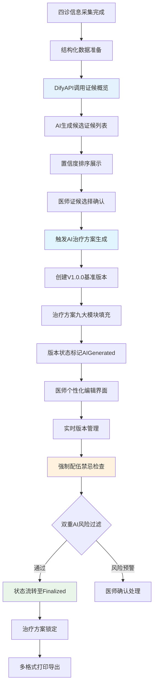

# 中医数字化诊疗平台需求分析说明书

**文档编号**：TCM-RD-001  
**版本号**：v2.1  
**编制日期**：2024年12月19日  
**编制人**：中医数字化诊疗平台项目团队  
**审核人**：赵东老师  
**批准人**：项目指导委员会  

**文档状态**：正式发布  
**密级**：内部公开  

## 9. 附录（标准化补充）

### 9.1 术语表（基于医疗信息化标准）

| 术语 | 英文全称 | 定义 | 标准来源 |
|------|----------|------|----------|
| 中医证候 | TCM Syndrome | 中医诊断中对疾病本质的概括，包括病因、病位、病性、邪正关系等 | 《中医证候分类与代码》GB/T 15657-2021 |
| 配伍禁忌 | Incompatibility | 中药配伍中可能产生毒副作用或降低疗效的组合 | 《中国药典》2020版 |
| 十八反 | Eighteen Incompatibilities | 中药配伍中的十八种相反药物组合 | 《神农本草经》传统理论 |
| 十九畏 | Nineteen Fears | 中药配伍中的十九种相畏药物组合 | 《神农本草经》传统理论 |
| 治疗方案 | Treatment Plan | 针对特定疾病制定的包括中药、针灸等多种治疗方法的综合方案 | HL7 FHIR R4标准 |
| 版本管理 | Version Control | 对治疗方案的不同版本进行创建、存储、对比和恢复的管理过程 | Git语义化版本规范 |
| 多租户 | Multi-tenancy | 单个应用实例为多个组织（租户）提供服务的数据隔离架构 | SaaS架构标准 |
| RBAC | Role-Based Access Control | 基于角色的访问控制模型 | NIST RBAC标准 |
| FHIR | Fast Healthcare Interoperability Resources | 医疗信息交换标准 | HL7国际组织 |
| DTO | Data Transfer Object | 数据传输对象设计模式 | 领域驱动设计(DDD) |

### 9.2 缩略语（技术标准化）

| 缩略语 | 全称 | 中文解释 | 技术标准 |
|--------|------|----------|----------|
| AI | Artificial Intelligence | 人工智能 | ISO/IEC 23053:2022 |
| API | Application Programming Interface | 应用程序编程接口 | RESTful API标准 |
| JWT | JSON Web Token | JSON网络令牌认证 | RFC 7519 |
| TLS | Transport Layer Security | 传输层安全协议 | TLS 1.3 RFC 8446 |
| AES | Advanced Encryption Standard | 高级加密标准 | FIPS 197 |
| SQL | Structured Query Language | 结构化查询语言 | ISO/IEC 9075 |
| CDN | Content Delivery Network | 内容分发网络 | 互联网标准 |
| RTO | Recovery Time Objective | 恢复时间目标 | 业务连续性标准 |
| RPO | Recovery Point Objective | 恢复点目标 | 灾难恢复标准 |
| SLA | Service Level Agreement | 服务等级协议 | IT服务管理标准 |

### 9.3 参考资料（权威标准清单）

#### 9.3.1 国家法规与标准
1. 《中华人民共和国中医药法》（2017年施行）
2. 《中医病历书写基本规范》（国中医药医政发〔2010〕29号）
3. 《处方管理办法》（国家卫生健康委令第53号，2022年修订）
4. 《中华人民共和国药典》2020年版
5. 《电子病历基本规范（试行）》（卫医政发〔2010〕24号）
6. 《个人信息保护法》（2021年施行）
7. 《网络安全法》（2017年施行）
8. 《数据安全法》（2021年施行）

#### 9.3.2 国际标准与规范
1. HL7 FHIR R4标准（医疗信息交换）
2. ISO/IEC 27001:2022（信息安全管理）
3. ISO/IEC 27701:2019（隐私信息管理）
4. NIST SP 800-53（安全和隐私控制）
5. OWASP Top 10 2021（Web应用安全）

#### 9.3.3 技术架构标准
1. .NET 8官方文档（Microsoft）
2. MySQL 8.0参考手册（Oracle）
3. Entity Framework Core 8.0文档
4. Redis官方文档
5. Docker容器化最佳实践

#### 9.3.4 中医信息化标准
1. 《中医证候分类与代码》GB/T 15657-2021
2. 《中医病证分类与代码》GB/T 16751-2023
3. 《中医基础理论术语》GB/T 20348-2006
4. 《中药编码规则及编码》GB/T 31774-2015

### 9.4 需求追踪矩阵（RTM）

| 需求编号 | 需求描述 | 业务目标 | 技术实现 | 测试用例 | 验收标准 |
|----------|----------|----------|----------|----------|----------|
| FR-001-001 | 患者身份识别 | 跨租户患者管理 | UserDetail实体 | TC-001-005 | 手机号唯一性验证 |
| FR-002-001 | AI治疗方案生成 | 提升诊疗效率 | DifyAPI集成 | TC-002-010 | 30秒内生成完成 |
| FR-002-002 | 高风险操作验证 | 医疗安全保障 | 四级风险验证机制 | TC-002-011 | 密码验证100%覆盖 |
| FR-002-002a | 风险分级管理 | 标准化风险处理 | 0-10分量化评分 | TC-002-011a | 评分准确率≥95% |
| FR-002-002b | 医生跳过权限 | 灵活性与安全性平衡 | 中风险可跳过确认 | TC-002-011b | 跳过权限控制100% |
| FR-002-002c | 不可跳过场景 | 强制安全措施 | 极高风险强制验证 | TC-002-011c | 强制验证覆盖率100% |
| FR-002-002d | 验证界面规范 | 用户体验一致性 | 统一四级验证界面 | TC-002-011d | 界面一致性检查通过 |
| FR-002-002e | 验证记录审计 | 合规性要求 | 完整验证链记录 | TC-002-011e | 审计覆盖率100% |
| FR-002-002f | 四级验证审核机制 | 诊所级审核体系 | 诊所药剂师/管理员审核 | TC-002-011f | 审核通过率≥99% |
| FR-002-002g | 实时审核通知 | 及时性保障 | SignalR实时通知 | TC-002-011g | 通知延迟<5秒 |
| FR-002-003 | 配伍禁忌检查 | 确保用药安全 | 十八反十九畏规则库 | TC-003-015 | 100%禁忌检测率 |
| FR-002-004 | 版本管理 | 治疗方案追溯 | Git语义化版本 | TC-004-020 | 版本回滚功能验证 |
| FR-002-005 | 审计记录生成 | 合规性追踪 | 统一审计服务 | TC-004-021 | 操作100%留痕 |
| FR-002-006 | 打印导出 | 医疗文档标准化 | PDF/A格式 | TC-005-025 | 符合病历规范 |

### 9.5 数据字典（核心实体规范）

#### 9.5.1 患者实体（UserDetail）
| 字段名 | 数据类型 | 约束条件 | 业务规则 |
|--------|----------|----------|----------|
| UserId | GUID | 主键，唯一 | 全局唯一患者标识 |
| PhoneNumber | VARCHAR(20) | 唯一索引，正则验证 | 11位大陆手机号 |
| FullName | NVARCHAR(50) | 必填，长度限制 | 患者真实姓名 |
| Gender | TINYINT | 枚举值(0,1,2) | 0未知1男2女 |
| BirthDate | DATE | 日期格式验证 | 年龄合理性检查 |
| CreatedAt | DATETIME | 自动填充 | 记录创建时间 |
| UpdatedAt | DATETIME | 自动更新 | 最后修改时间 |

#### 9.5.2 治疗方案实体（TreatmentPlan）
| 字段名 | 数据类型 | 约束条件 | 业务规则 |
|--------|----------|----------|----------|
| PlanId | GUID | 主键，唯一 | 治疗方案唯一标识 |
| PatientId | GUID | 外键，关联患者 | 患者关联关系 |
| Version | VARCHAR(20) | 语义化版本号 | V{major}.{minor}.{patch} |
| Status | VARCHAR(20) | 枚举状态值 | 6种状态流转 |
| IsAiOriginated | BIT | 布尔值 | AI生成标记 |
| CreatedBy | GUID | 创建者ID | 医生或AI标识 |
| Content | JSON | 结构化治疗方案 | 九大治疗体系数据 |

---

## 10. 文档版本控制

### 10.1 版本历史记录

| 版本 | 日期 | 作者 | 审核人 | 变更类型 | 变更描述 | 影响范围 |
|------|------|------|--------|----------|----------|----------|
| V1.0 | 2024-01-15 | 项目团队 | - | 初始创建 | 基础需求文档 | 全文档 |
| V2.0 | 2024-03-20 | 项目团队 | 赵东老师 | 重大更新 | 基于开发计划重构 | 全文档 |
| V2.1 | 2024-12-19 | 项目团队 | 技术委员会 | 标准化更新 | 符合医疗信息化标准 | 功能需求、非功能需求 |

### 10.2 审批记录

| 审批阶段 | 审批人 | 审批日期 | 审批意见 | 状态 |
|----------|--------|----------|----------|------|
| 技术评审 | 架构师 | 2024-12-19 | 技术方案可行，符合标准 | 通过 |
| 业务评审 | 中医专家组 | 2024-12-19 | 业务需求完整，符合中医规范 | 通过 |
| 合规评审 | 法务部 | 2024-12-19 | 符合医疗法规要求 | 通过 |
| 最终批准 | 项目经理 | 2024-12-19 | 批准实施 | 通过 |

---

**文档状态**：✅ 已批准（Approved）
**生效日期**：2024年12月19日
**下次评审日期**：2025年3月19日
**文档所有权**：中医数字化诊疗平台项目组

## 修订记录

| 版本 | 日期 | 修订内容 | 修订人 | 审核人 |
|------|------|----------|--------|--------|
| v2.1 | 2024-12-19 | 依据标准规范重新组织内容，整合开发计划需求 | 项目团队 | 赵东老师 |
| v2.0 | 2024-02-10 | 初始版本 | 项目团队 | 赵东老师 |

---

## 1. 引言

### 1.1 编写目的

本文档旨在全面分析中医数字化诊疗平台的需求，为系统设计和开发提供详细的指导依据。通过深入的需求分析，确保系统能够满足中医诊疗的专业需求，支持多租户架构，并提供AI辅助诊断功能。

#### 1.1.1 文档范围
- 业务需求分析
- 用户需求分析
- 功能需求分析
- 非功能需求分析
- 系统约束分析
- 开发与实施规范

#### 1.1.2 预期读者
- 项目管理团队
- 系统架构师
- 开发团队
- 测试团队
- 产品经理
- 中医专家顾问
- 医疗质量监管人员

### 1.2 项目背景

#### 1.2.1 项目概述
中医数字化诊疗平台是一个基于现代信息技术的中医诊疗辅助系统，旨在通过数字化手段提升中医诊疗的效率和准确性。平台采用多租户SaaS架构，支持多个医疗机构独立使用，同时提供AI辅助诊断功能。

#### 1.2.2 项目目标
- **数字化转型**：将传统中医诊疗流程数字化，提高诊疗效率
- **标准化管理**：建立标准化的中医诊疗流程和病历管理体系
- **AI辅助诊断**：利用人工智能技术辅助中医师进行证候分析和诊断
- **多租户服务**：为不同医疗机构提供独立、安全的诊疗服务
- **合规性保障**：确保系统符合中医药法规和医疗标准

#### 1.2.3 业务价值
- 提高中医诊疗的准确性和一致性
- 减少医生工作负担，提升诊疗效率
- 促进中医标准化和规范化发展
- 为中医教育和研究提供数据支撑
- 实现医疗资源的优化配置
- 保障患者用药安全和治疗效果

### 1.3 术语定义

| 术语 | 定义 |
|------|------|
| 中医四诊 | 望、闻、问、切四种诊断方法 |
| 证候 | 中医诊断中对疾病本质的概括 |
| 方剂 | 中医处方的统称 |
| AI辅助诊断 | 利用人工智能算法分析症状数据提供诊断建议 |
| 个性化治疗 | 根据患者个体差异制定针对性治疗方案 |
| 多租户 | 一个软件架构，支持多个客户（租户）共享同一应用实例 |
| SaaS | Software as a Service，软件即服务 |
| 电子病历 | 以电子化方式创建、存储、传输和重现的病历 |
| 辨证论治 | 中医认识疾病和治疗疾病的基本原则 |
| 配伍禁忌 | 中药配伍中的禁忌组合，包括十八反、十九畏等 |
| 治疗方案 | 包含九大治疗模块的完整中医治疗建议 |
| 版本控制 | 对治疗方案修改历史的完整记录和管理 |

### 1.4 参考资料
- 《中医药法》
- 《中医诊断学》国家规划教材
- 《中医内科学》国家规划教材
- 《中医病历书写基本规范》
- 《电子病历系统功能规范（试行）》
- 《个人信息保护法》
- 《网络安全法》
- 《中华人民共和国药典》2020年版
- HL7 FHIR标准
- 《处方管理办法》

### 1.5 文档约定
- **术语规范**：采用GB/T 20348-2006《中医基础理论术语》标准
- **符号说明**：
  - ✅ 表示已实现功能
  - 🔄 表示待实现功能
  - ⚠️ 表示风险点
  - 📊 表示数据统计功能
- **格式规范**：
  - 功能需求采用"FR-XXX-XXX"格式
  - 用户故事采用"作为...我想要...以便..."格式
  - 业务流程采用Mermaid图表表示

---

## 2. 需求分析方法

### 2.1 需求获取方法
- **访谈法**：与中医专家、临床医师、患者进行深入访谈
- **问卷调查**：向目标用户群体发放需求调研问卷
- **现场观察**：实地观察中医诊疗流程
- **文献研究**：分析中医诊疗相关标准和规范
- **竞品分析**：研究现有中医信息化产品
- **专家咨询**：邀请中医药领域专家进行需求评审

### 2.2 需求分析工具
- **用例图**：描述系统功能与用户交互
- **活动图**：展示业务流程
- **类图**：描述系统静态结构
- **时序图**：描述系统动态行为
- **原型设计**：Axure原型工具
- **用户故事地图**：可视化用户需求和优先级

### 2.3 需求优先级评估方法
采用MoSCoW方法进行需求优先级划分：
- **Must have（必须有）**：系统核心功能，必须实现
- **Should have（应该有）**：重要功能，尽量实现
- **Could have（可以有）**：增值功能，时间允许时实现
- **Won't have（暂不需要）**：后续版本考虑

---

## 3. 业务需求分析

### 3.1 业务目标

#### 3.1.1 总体目标
建立一套标准化的中医数字化诊疗平台，实现中医诊疗流程的数字化、智能化，提高中医诊疗的准确性和一致性，确保医疗质量和患者安全。

#### 3.1.2 具体目标
- **诊断标准化**：建立统一的中医诊断标准库，规范证候诊断流程
- **决策智能化**：通过AI算法提供智能诊断建议，辅助医生决策
- **流程规范化**：规范中医诊疗业务流程，确保诊疗质量
- **数据可视化**：提供直观的诊疗数据展示和分析
- **安全可控化**：建立完整的用药安全检查和风险管控体系
- **版本可追溯**：实现治疗方案全生命周期的版本管理

### 3.2 业务流程分析

#### 3.2.1 患者就诊总流程（基于四诊辨病AI生成规范）


#### 3.2.2 四诊辨病到AI治疗方案生成流程（基于技术实现规范）


#### 3.2.3 四诊信息采集标准化流程（基于AI证候生成需求）

**前置条件**：患者档案已建立，就诊记录已创建

**四诊数据结构规范**：

1. **望诊信息采集（Visual Examination）**
   - **舌象数据**：
     - 舌质：淡红舌、红舌、绛舌、紫舌、淡白舌（枚举值）
     - 舌苔：薄白苔、白腻苔、黄苔、黄腻苔、灰黑苔、无苔（枚举值）
     - 舌形：正常、胖大、瘦薄、裂纹、齿痕（枚举值）
   - **面色数据**：
     - 主色：红润、苍白、萎黄、潮红、青紫、黧黑（枚举值）
     - 光泽：明亮、晦暗、枯槁（枚举值）
   - **形态数据**：
     - 体型：偏瘦、正常、偏胖、肥胖（枚举值）
     - 精神状态：良好、一般、萎靡、烦躁（枚举值）

2. **闻诊信息采集（Auscultation & Olfaction）**
   - **声音特征**：
     - 语声：正常、低微、高亢、嘶哑（枚举值）
     - 呼吸：平稳、急促、气喘、气短（枚举值）
   - **气味特征**：
     - 口气：无异味、口臭、酸臭（枚举值）
     - 体味：正常、汗臭、特殊气味（枚举值）

3. **问诊信息采集（Inquiry）**
   - **主诉症状**：文本描述（必填，10-200字符）
   - **症状分类**：
     - 寒热：恶寒、发热、寒热往来、无寒热（枚举值）
     - 汗出：无汗、自汗、盗汗、大汗（枚举值）
     - 疼痛：部位、性质、程度（结构化数据）
     - 饮食：食欲、口味、口渴（枚举值）
     - 睡眠：正常、失眠、多梦、嗜睡（枚举值）
     - 二便：大便、小便性状（枚举值）
   - **发病信息**：
     - 起病时间：日期时间格式
     - 发病诱因：文本描述（可选）
     - 病情变化：加重、减轻、无变化（枚举值）

4. **切诊信息采集（Palpation）**
   - **脉象数据**：
     - 脉位：浮、中、沉（枚举值）
     - 脉率：迟、缓、数、疾（枚举值，次/分钟）
     - 脉律：规整、不齐、结代（枚举值）
     - 脉力：虚、弱、微、实（枚举值）
     - 脉形：细、洪、弦、滑、涩（枚举值）
   - **腹诊数据**：
     - 腹部温度：正常、凉、热（枚举值）
     - 腹部张力：软、正常、硬、拒按（枚举值）
     - 压痛部位：文本描述（可选）

**数据标准化要求**：
- 所有枚举值必须符合《中医证候分类与代码》GB/T 15657-2021标准
- 数值型数据必须包含单位（如脉率：次/分钟）
- 时间数据必须采用ISO 8601标准格式
- 文本描述必须支持Unicode字符，限制长度防止注入攻击

**AI输入格式**：
```json
{
  "patientInfo": {
    "basicInfo": { /* 患者基础信息 */ },
    "fourDiagnostics": {
      "inspection": { /* 望诊数据 */ },
      "auscultationOlfaction": { /* 闻诊数据 */ },
      "inquiry": { /* 问诊数据 */ },
      "palpation": { /* 切诊数据 */ }
    }
  },
  "visitInfo": {
    "chiefComplaint": "主诉症状",
    "historyOfPresentIllness": "现病史",
    "duration": "发病时长"
  }
}
```

### 3.3 业务规则

#### 3.3.1 诊断规则
- **证候诊断**：基于症状组合进行证候判断，符合《中医证候诊断标准》
- **疾病诊断**：符合《中医病证分类与代码》标准
- **诊断依据**：必须有充分的四诊信息支持
- **诊断级别**：初步诊断、确定诊断、修正诊断
- **诊断一致性**：确保AI建议与医生最终诊断的一致性

#### 3.3.2 处方规则
- **组方原则**：符合君臣佐使配伍原则
- **剂量规范**：符合《中国药典》规定剂量范围
- **禁忌检查**：自动检查十八反、十九畏等配伍禁忌
- **特殊人群**：儿童、孕妇、老年人剂量自动调整
- **疗程规范**：根据病情设定合理的疗程时长

#### 3.3.3 版本管理规则
- **版本号规范**：采用语义化版本控制，格式为`V{主版本}.{次版本}.{修订版本}`
- **状态流转**：AIGenerated → Editing → Checking → Finalized → Archived
- **版本保护**：AI生成版本（V0）永久保存，不可修改
- **审计要求**：每次版本变更必须记录完整的操作轨迹

#### 3.3.4 高风险操作验证规则（四级验证体系）
- **风险分级标准**：
  - 0-4分：低风险，自动通过
  - 5-6分：中风险，确认对话框（可跳过）
  - 7-9分：高风险，医生密码验证（不可跳过）
  - 10+分：极高风险，诊所药剂师/管理员多级审核（不可跳过）
- **触发场景**：
  - 毒性药材使用（≥5分）
  - 特殊人群用药（孕妇、儿童、老人）（≥7分）
  - 配伍禁忌组合（≥7分）
  - 剧毒药物组合（≥10分）
- **验证流程**：风险评估→风险等级判断→对应验证→审计记录
- **跳过机制**：仅中风险操作允许医生跳过确认，高风险及以上强制验证
- **审核机制**：极高风险操作需诊所药剂师或管理员专业审核
- **审计要求**：所有验证记录保存10年，支持完整追溯查询

---

## 4. 用户需求分析

### 4.1 用户角色分析（基于标准规范）

#### 4.1.1 医师用户（TCM-PRACTITIONER）
**角色定义**：具备中医执业医师资格的专业医疗人员

**角色特征**：
- **资质要求**：持有国家中医药管理局颁发的中医执业医师证书
- **年龄分布**：25-65岁，具备5年以上临床经验
- **技术能力**：熟练使用计算机系统，具备数字化诊疗认知
- **业务场景**：日常门诊、复诊管理、治疗方案制定

**核心功能需求**：
- **FR-USER-001** 患者档案管理：跨租户患者识别、手机号查询、档案创建
- **FR-USER-002** 就诊记录管理：标准化电子病历创建、证候确认、诊断记录
- **FR-USER-003** AI治疗方案生成：基于证候的智能化治疗方案生成
- **FR-USER-004** 治疗方案编辑：个性化调整、模块化编辑、版本控制
- **FR-USER-005** 配伍禁忌检查：自动化安全审查、风险分级管控
- **FR-USER-006** 处方开具：符合《处方管理办法》的标准化处方
- **FR-USER-007** 版本管理：治疗方案全生命周期版本控制
- **FR-USER-008** 打印导出：多场景专业格式输出

**非功能需求**：
- 响应时间：患者查询<2秒，AI生成<5秒
- 并发支持：支持50个医师同时在线操作
- 数据安全：符合《电子病历基本规范》要求

#### 4.1.2 患者用户（PATIENT）
**角色定义**：接受中医诊疗服务的个人用户

**角色特征**：
- **年龄分布**：全年龄段，以25-70岁为主
- **技术能力**：基础计算机操作能力，移动端使用熟练
- **认知水平**：对中医诊疗有基本认知和信任
- **关注点**：诊疗效果、用药安全、隐私保护

**核心功能需求**：
- **FR-PAT-001** 个人档案管理：手机号注册、基础信息维护
- **FR-PAT-002** 诊疗记录查看：跨机构完整诊疗历史
- **FR-PAT-003** 治疗方案理解：通俗化治疗内容展示
- **FR-PAT-004** 用药指导：服药提醒、注意事项提示
- **FR-PAT-005** 健康管理：个人健康档案、随访计划

**非功能需求**：
- 隐私保护：符合《个人信息保护法》要求
- 易用性：支持语音朗读、术语解释功能
- 可访问性：支持无障碍访问标准

#### 4.1.3 系统管理员（SYSTEM-ADMIN）
**角色定义**：负责系统运维管理的技术专业人员

**角色特征**：
- **技术背景**：具备系统运维、数据库管理、网络安全专业技能
- **职责范围**：系统配置、用户管理、数据安全、合规审计
- **操作频率**：日常监控、定期维护、应急响应

**核心功能需求**：
- **FR-ADMIN-001** 系统配置管理：租户配置、参数设置
- **FR-ADMIN-002** 用户权限管理：角色权限分配、访问控制
- **FR-ADMIN-003** 数据安全管理：备份恢复、加密存储
- **FR-ADMIN-004** 审计日志管理：操作记录、合规检查
- **FR-ADMIN-005** 系统监控：性能监控、异常报警

#### 4.1.4 辅助角色定义
- **药房人员（PHARMACIST）**：处方审核、药品配发
- **研究人员（RESEARCHER）**：匿名化数据获取、统计分析
- **监管人员（REGULATOR）**：合规性检查、质量审计

### 4.2 功能需求分析

#### 4.2.1 功能需求分类与编号规范

**功能需求编号规范**：
- **一级功能**：FR-XXX（如FR-001患者管理）
- **二级功能**：FR-XXX-XXX（如FR-001-001患者注册）
- **三级功能**：FR-XXX-XXX-XXX（如FR-001-001-001手机号注册）

**功能优先级标识**：
- **P0（必须有）**：系统核心功能，缺失将导致系统无法运行
- **P1（应该有）**：重要功能，缺失将影响用户体验
- **P2（可以有）**：增值功能，缺失不影响核心功能
- **P3（暂不需要）**：后续版本考虑

#### 4.2.2 核心功能模块需求

##### 4.2.2.1 四诊辨病与AI证候生成模块（基于SyndromeDomain技术规范）

**FR-001 四诊信息采集与标准化（P0级核心功能）**

**FR-001-001 结构化四诊数据采集**
**需求描述**：建立标准化的中医四诊信息采集系统，为AI证候分析提供结构化数据输入

**功能规范**：
- **望诊数据采集**：
  - 舌象：舌质（5种枚举值）、舌苔（6种枚举值）、舌形（5种枚举值）
  - 面色：主色（6种枚举值）、光泽（3种枚举值）
  - 形态：体型（4种枚举值）、精神状态（4种枚举值）
- **闻诊数据采集**：
  - 声音特征：语声（4种枚举值）、呼吸（4种枚举值）
  - 气味特征：口气（3种枚举值）、体味（3种枚举值）
- **问诊数据采集**：
  - 主诉症状：文本输入（10-200字符限制）
  - 症状分类：寒热、汗出、疼痛、饮食、睡眠、二便（标准化枚举）
  - 发病信息：起病时间、诱因、病情变化（时间格式+文本）
- **切诊数据采集**：
  - 脉象数据：脉位、脉率、脉律、脉力、脉形（标准化枚举+数值）
  - 腹诊数据：温度、张力、压痛部位（枚举+文本）

**技术规范**：
- 所有枚举值符合GB/T 15657-2021《中医证候分类与代码》标准
- 数据验证：客户端实时验证+服务端二次验证
- 数据格式：JSON结构化存储，支持Unicode字符
- 性能要求：单条记录保存<500ms，支持并发50用户

**FR-001-002 AI证候候选生成**
**需求描述**：基于标准化四诊数据，通过DifyAPI调用AI系统生成候选证候清单

**功能规范**：
- **AI调用机制**：
  - API接口：调用SyndromeDomain.GetSyndromeOverviewAsync方法
  - 输入参数：patientDescription（四诊结构化数据）、visitDescription（就诊信息）
  - 输出格式：List<SyndromeOverviewDto>（证候概览列表）
- **证候数据结构**：
  - 证候名称：符合《中医证候分类与代码》标准名称
  - 置信度：0-100%数值，保留2位小数
  - 主症列表：JSON数组格式，最多5个主症
  - 常见病：JSON数组格式，关联证候的常见疾病
- **性能要求**：
  - 响应时间：≤5秒（含网络延迟）
  - 并发支持：支持10个医师同时调用
  - 错误处理：网络超时、API异常、数据格式错误

**业务规则**：
- 置信度阈值：≥60%的证候才显示给医师
- 排序规则：按置信度降序排列，最多显示5个候选证候
- 数据缓存：同一就诊记录30分钟内重复调用使用缓存
- 审计记录：记录每次API调用的请求参数和响应结果

**FR-001-003 医师证候选择确认**
**需求描述**：医师基于临床判断从AI候选证候中选择最终确证证候

**功能规范**：
- **选择界面**：
  - 候选证候列表：显示证候名称、置信度、主症摘要
  - 详细信息查看：支持查看证候详情（调用GetSyndromeDetailAsync）
  - 选择确认：单选模式，医师必须且只能选择一个证候
- **确认流程**：
  - 医师选择证候后触发治疗方案生成
  - 系统自动记录医师确证时间和选择理由（可选输入）
  - 取消同一就诊下其他证候的确证状态
- **数据更新**：
  - 更新Syndrome实体：IsConfirmed=true，记录确认时间
  - 触发治疗方案生成：自动调用AI治疗方案生成流程

##### 4.2.2.2 AI治疗方案生成模块（基于技术实现规范）

**FR-002 AI治疗方案自动生成（P0级核心功能）**

**FR-002-001 基于确证证候的治疗方案生成**
**需求描述**：医师确认证候后，AI系统基于确证证候自动生成完整的治疗方案

**功能规范**：
- **触发条件**：
  - 前置条件：医师已确证证候（IsConfirmed=true）
  - 自动触发：证候确认后立即启动AI生成流程
  - 零用户交互：符合开发计划2的零用户交互设计原则
- **生成机制**：
  - 数据基础：患者完整信息+确证证候+四诊数据
  - AI模型：基于DifyAPI的治疗方案生成工作流
  - 版本创建：自动生成V1.0.0基准版本（符合语义化版本规范）
- **输出内容**：
  - 九大治疗模块：中药处方、针灸、艾灸、拔罐、推拿按摩、食疗药膳、生活方式、饮食建议、随访计划
  - 每个模块包含：治疗内容、操作方法、注意事项、疗程安排
  - 风险标识：自动标记潜在风险点和禁忌症

**技术实现**：
- **实体映射**：
  - TreatmentPlan实体：PlanId（GUID）、Version（V1.0.0）、Status（AIGenerated）
  - 九大模块实体：Acupuncture、Moxibustion、Cupping、Massage、HerbalPrescription等
- **状态管理**：
  - 初始状态：AIGenerated（自动生成标记）
  - 版本锁定：V1.0.0永久保存，不可修改
  - 后续版本：支持V1.1.0、V1.2.0等迭代版本

**性能要求**：
- 生成时间：≤30秒（复杂病例≤60秒）
- 成功率：≥99%（排除网络异常）
- 数据完整性：所有必填字段100%填充

**FR-002-002 治疗方案版本管理**
**需求描述**：实现治疗方案的全生命周期版本管理，支持医师个性化编辑

**功能规范**：
- **版本控制**：
  - 版本号规范：V{主版本}.{次版本}.{修订版本}
  - 状态流转：AIGenerated → Editing → Checking → Finalized → Archived
  - 版本保护：V1.0.0（AI版）永久保存作为基准
- **编辑功能**：
  - 模块化编辑：九大模块独立编辑，支持启用/禁用
  - 实时预览：修改内容即时生效，可视化界面
  - 变更追踪：字段级变更记录，支持撤销/重做
- **版本对比**：
  - 任意版本间差异对比
  - 字段级变更高亮显示
  - 版本演进树可视化展示

**FR-002-003 双重AI风险过滤机制**
**需求描述**：在治疗方案定稿前，通过双重AI过滤确保临床安全性

**功能规范**：
- **第一重过滤**：
  - 配伍禁忌检查：基于《中国药典》2020版十八反十九畏规则
  - 特殊人群预警：孕妇、儿童、老年人用药禁忌
  - 剂量安全检查：基于体质、年龄的个性化剂量上限
- **第二重过滤**：
  - 医师强制确认：高风险方案必须医师二次确认
  - 专家会诊建议：复杂病例支持多学科会诊
  - 患者知情同意：高风险治疗需患者书面同意

**业务规则**：
- 风险分级：红色（严禁）、橙色（慎用）、黄色（注意）
- 强制检查：定稿前必须完成全面安全检查
- 记录要求：所有风险确认操作必须记录审计日志
- 合规标准：符合《处方管理办法》和《中医病历书写规范》）

**技术规范**：
- **数据模型**：符合开发计划1中UserDetail实体规范
- **验证机制**：手机号格式验证、姓名合法性验证、年龄合理性验证
- **关联管理**：支持多租户关联，权限控制基于租户隔离原则

**FR-001-002 跨租户患者识别与授权管理**
**需求描述**：实现跨医疗机构的患者识别与数据共享授权机制

**功能规范**：
- **识别机制**：通过手机号精确匹配平台已注册患者
- **授权流程**：
  1. 医生发起患者关联请求
  2. 系统验证患者身份和授权状态
  3. 患者或租户管理员确认授权
  4. 建立租户-患者关联关系
  5. 同步患者基础信息到当前租户

**数据隔离规则**：
- **基础信息共享**：姓名、性别、出生日期等基础信息跨租户共享
- **医疗数据隔离**：各租户内的诊疗记录、处方数据严格隔离
- **授权撤销**：患者可随时撤销租户关联，撤销后自动清除该租户内的关联数据
- **审计追踪**：所有授权操作记录操作人、时间、原因等完整审计信息

**技术实现**：
- **关联表设计**：PatientTenantAssociation（患者-租户关联表）
- **权限矩阵**：基于角色的细粒度权限控制
- **数据同步**：采用事件驱动架构实现跨租户数据同步

##### 4.2.2.2 治疗方案管理模块

##### 4.2.2.2 治疗方案管理模块（基于开发计划标准）

**FR-002 治疗方案全生命周期管理（P0级核心功能）**

**FR-002-001 AI智能治疗方案生成（开发计划2标准实现）**
**需求描述**：基于零用户交互设计哲学，实现全自动AI治疗方案生成系统

**功能规范**：
- **输入规范**：
  - 患者主诉：症状描述（文本，1000字符内）
  - 四诊信息：舌象、脉象、面色、声音（结构化数据）
  - 既往病史：过敏史、用药史、手术史（枚举值列表）
  - 体质辨识：中医体质分类（9种基本体质）

- **AI生成内容（九大治疗体系标准）**：
  1. **中药治疗**：药材清单、剂量(g)、煎服法、疗程
  2. **针灸治疗**：穴位组合、针刺手法、留针时间、频次
  3. **艾灸疗法**：穴位选择、灸法类型、施灸时间、注意事项
  4. **拔罐疗法**：拔罐部位、留罐时间、拔罐类型、禁忌
  5. **推拿按摩**：操作部位、手法技巧、操作时间、频次
  6. **食疗调理**：食材推荐、烹饪方法、饮食禁忌、调理周期
  7. **运动疗法**：运动类型、运动强度、持续时间、注意事项
  8. **情志调节**：情绪管理方法、心理调适技巧、实施建议
  9. **起居调摄**：作息建议、环境调节、生活习惯、养生要点

- **技术实现标准**：
  - **状态管理**：AIGenerated → Editing → Checking → Finalized 四态流转
  - **数据模型**：符合TreatmentPlan实体规范，包含IsAiOriginated=true标记
  - **性能要求**：单次生成时间≤30秒，支持并发10个请求
  - **API规范**：DifyAPI集成，RESTful接口设计

**FR-002-002 治疗方案内容管理与编辑（开发计划3标准实现）**
**需求描述**：提供专业的治疗方案可视化编辑环境，支持九大治疗体系的精细化调整

**功能规范**：
- **编辑界面标准**：
  - **药材编辑器**：支持药材名称智能搜索、剂量滑块调节、煎服法下拉选择
  - **穴位编辑器**：可视化人体穴位图，支持点选添加/删除穴位
  - **操作编辑器**：结构化输入模板，支持频次、时长、注意事项的规范化录入

- **数据验证机制**：
  - **药材验证**：名称合法性检查、剂量范围验证（0.1-100g）
  - **穴位验证**：名称标准化（国标穴位名称）、操作安全性检查
  - **内容完整性**：必填字段检测、逻辑一致性验证

- **版本控制**：
  - **编辑状态**：每次保存自动生成新版本（V{major}.{minor}.{patch}）
  - **版本对比**：支持文本级差异对比和高亮显示
  - **回滚机制**：一键回滚到任意历史版本

**FR-002-003 配伍禁忌智能检查（开发计划4标准实现）**
**需求描述**：基于《中国药典》和中医经典理论，实现十八反十九畏配伍禁忌的智能检测系统

**禁忌检查规则库**：
- **十八反配伍禁忌**：
  - 甘草反：甘遂、大戟、海藻、芫花（禁用组合）
  - 乌头反：贝母、瓜蒌、半夏、白蔹、白及（禁用组合）
  - 藜芦反：人参、丹参、玄参、沙参、细辛、芍药（禁用组合）

- **十九畏配伍禁忌**：
  - 硫黄畏朴硝、水银畏砒霜、狼毒畏密陀僧
  - 巴豆畏牵牛、丁香畏郁金、牙硝畏三棱
  - 川乌草乌畏犀角、人参畏五灵脂、官桂畏赤石脂

- **特殊人群禁忌**：
  - **妊娠禁忌**：禁用活血化瘀、泻下攻逐、毒性药材
  - **儿童禁忌**：禁用毒性药材、限制峻猛药物
  - **老年禁忌**：慎用泻下药、毒性药材减量

- **穴位禁忌**：
  - **妊娠禁针**：合谷、三阴交、腰骶部穴位、腹部穴位
  - **小儿禁针**：囟门、风府、哑门等危险穴位

**检查机制**：
- **实时检测**：编辑过程中毫秒级响应禁忌提示
- **风险分级**：
  - 🔴 严重禁忌：立即阻止保存，强制修改
  - 🟡 注意事项：弹窗提醒，可确认后继续
  - 🔵 优化建议：提示信息，仅供参考
- **处理流程**：检测→提示→修改→确认→记录审计日志

**FR-002-004 治疗方案版本管理（开发计划5标准实现）**
**需求描述**：实现治疗方案的全生命周期版本管理，支持精细化状态流转控制

**状态机设计**：
```
AIGenerated (AI生成) 
    ↓ (医生开始编辑)
Editing (编辑中) 
    ↓ (编辑完成)
Checking (审核中) 
    ↓ (审核通过)
Finalized (已确认) 
    ↓ (需要修改)
Versioning (版本更新中)
    ↓ (归档)
Archived (已归档)
```

**版本管理规范**：
- **版本编号**：V{major}.{minor}.{patch}（例：V2.1.3）
- **状态转换规则**：
  - AIGenerated → Editing：医生首次编辑
  - Editing → Checking：编辑完成提交审核
  - Checking → Finalized：审核通过
  - Finalized → Versioning：需要修改时
  - 任意状态 → Archived：方案过期或停用

- **版本元数据**：
  - 创建信息：创建者、创建时间、AI模型版本
  - 修改信息：最后修改者、修改时间、修改原因
  - 审核信息：审核者、审核时间、审核意见

**FR-002-005 治疗方案审计与日志（开发计划6标准实现）**
**需求描述**：建立完整的治疗方案操作审计体系，满足医疗合规要求

**审计日志规范**：
- **操作类型**：创建、修改、审核、打印、导出、删除、恢复
- **日志内容**：
  - 操作人：用户ID、角色、所属租户
  - 操作时间：精确到毫秒的时间戳
  - 操作详情：操作类型、变更内容、操作前状态、操作后状态
  - 操作IP：客户端IP地址、地理位置信息

- **审计追踪**：
  - **数据完整性**：确保日志不可篡改，采用数字签名
  - **查询接口**：支持按时间、用户、操作类型等多维度查询
  - **报表生成**：自动生成月度、年度审计报告
  - **合规导出**：支持CSV、PDF格式导出审计记录

**FR-002-006 治疗方案打印与导出（开发计划7标准实现）**
**需求描述**：提供专业的治疗方案打印和导出功能，支持多种格式和模板

**导出格式标准**：
- **PDF格式**：
  - **标准模板**：含医院标识、医生电子签名、防伪水印
  - **内容结构**：患者信息、诊断结果、治疗方案、注意事项、医嘱
  - **版式设计**：A4纸张、宋体小四号字、专业排版

- **Word格式**：
  - **可编辑模板**：保留结构化数据，支持后续修改
  - **样式规范**：标题样式、表格样式、段落样式统一

- **图片格式**：
  - **快照导出**：治疗方案完整截图，支持PNG/JPG
  - **分享功能**：二维码分享、微信分享集成

**打印控制**：
- **权限管理**：基于角色的打印权限控制
- **打印记录**：每次打印记录操作日志
- **防伪措施**：二维码验证、防伪水印、医生电子签名
- **批量打印**：支持多个方案批量导出和打印

##### 4.2.2.3 审计与日志管理模块

**FR-003 系统审计与日志管理**

**FR-003-001 完整审计日志记录**
- **需求描述**：系统对所有治疗方案操作进行全程审计记录
- **用户故事**：
  - 作为医疗质量管理人员，我想要系统对所有治疗方案操作进行全程审计记录，涵盖治疗模块的所有实体操作，以便确保医疗行为的可追溯性
- **审计内容**：
  - **版本创建审计**：记录每次版本创建的触发原因（AI生成、手动创建、分支创建等）
  - **状态变更审计**：详细记录每次状态变更的操作者、变更时间、变更原因、影响范围
  - **内容修改审计**：追踪每个字段的修改历史，包括修改前后的值、修改时间戳、操作者信息
  - **权限审计**：记录谁有权限查看、编辑、审核、作废各个版本
  - **合规审计**：确保所有操作符合医疗行业法规要求，支持合规性报告生成
- **审计要求**：
  - 所有审计日志保存至少10年
  - 支持按时间、用户、操作类型等多维度查询
  - 定期生成审计摘要报告，包括高频操作、异常操作、合规性评估
- **优先级**：P0

#### 4.2.3 非功能性需求（基于技术标准规范）

##### 4.2.3.1 性能需求（基于.NET 8 + MySQL 8.0架构）
**响应时间标准**：
| 操作类型 | 响应时间要求 | 并发用户数 | 测试基准 |
|----------|--------------|------------|----------|
| 患者档案查询 | ≤500ms | 100并发 | 100万条数据 |
| AI治疗方案生成 | ≤30秒 | 10并发 | 复杂症状组合 |
| 配伍禁忌检查 | ≤1秒 | 50并发 | 1000味药材库 |
| 版本对比查询 | ≤2秒 | 20并发 | 100个版本历史 |
| 打印导出 | ≤5秒 | 5并发 | 10页PDF文档 |

**系统吞吐量**：
- **数据库连接池**：最大连接数200，连接超时30秒
- **API限流**：单个用户每分钟最多100次请求
- **缓存策略**：Redis缓存，TTL 1小时，命中率≥90%
- **CDN加速**：静态资源加载时间≤500ms

##### 4.2.3.2 安全性需求（医疗级安全标准）
**数据加密标准**：
- **传输加密**：TLS 1.3协议，HTTPS全站加密
- **存储加密**：
  - 患者敏感信息：AES-256加密，密钥轮换周期90天
  - 数据库连接：SSL/TLS加密传输
  - 文件存储：服务器端加密（SSE-S3）

**身份认证与授权**：
- **多因子认证**：
  - 医生登录：密码 + 短信验证码 + 设备指纹
  - 患者登录：手机号 + 短信验证码
- **访问控制**：
  - 基于RBAC的细粒度权限控制
  - 数据权限精确到字段级别
  - API级别的权限验证（JWT Token）

**审计与合规**：
- **日志标准**：
  - 操作日志保留7年（符合医疗法规）
  - 审计日志不可篡改（区块链存证）
  - 敏感操作实时告警（短信/邮件通知管理员）
- **合规认证**：
  - 三级等保认证要求
  - ISO 27001信息安全管理
  - 医疗数据安全合规（HIPAA参考）

##### 4.2.3.3 可靠性需求（高可用架构）
**系统可用性指标**：
- **整体可用性**：99.95%（年度停机时间≤4.38小时）
- **核心功能可用性**：99.99%（AI生成、禁忌检查）
- **故障恢复时间**：
  - 服务故障：自动切换≤30秒
  - 数据库故障：主从切换≤2分钟
  - 数据中心故障：异地容灾切换≤5分钟

**数据可靠性**：
- **备份策略**：
  - 实时热备份：主从数据库同步延迟≤1秒
  - 定时冷备份：每日凌晨2点全量备份
  - 异地容灾：异地机房实时同步，RPO≤1分钟
- **数据一致性**：
  - 分布式事务：保证跨服务数据一致性
  - 最终一致性：异步补偿机制，最大延迟5分钟

**监控与告警**：
- **监控指标**：
  - 系统性能：CPU、内存、磁盘、网络使用率
  - 应用性能：API响应时间、错误率、吞吐量
  - 业务指标：用户活跃度、功能使用率
- **告警机制**：
  - 多级告警：提醒、警告、严重、致命
  - 多渠道通知：短信、邮件、钉钉、企业微信
  - 自动恢复：关键故障自动重启服务

##### 4.2.3.4 易用性需求（用户体验标准）
**界面设计规范**：
- **设计标准**：
  - 遵循Material Design 3.0设计规范
  - 响应式设计：支持PC、平板、手机多端适配
  - 色彩无障碍：WCAG 2.1 AA级标准
- **交互体验**：
  - 页面加载骨架屏：减少等待焦虑
  - 操作反馈：所有操作提供即时反馈（成功/失败/警告）
  - 智能提示：基于用户行为的智能操作建议

**学习与支持**：
- **用户培训**：
  - 在线交互式教程：新用户首次登录引导
  - 视频教程：核心功能操作演示（5分钟内）
  - 帮助文档：可搜索的在线帮助中心
- **技术支持**：
  - 7×24小时在线客服
  - 工单系统：平均响应时间≤2小时
  - 用户社区：医生用户交流平台

**国际化与本地化**：
- **多语言支持**：
  - 简体中文（默认）、繁体中文、英文界面
  - 中医术语标准化翻译（WHO标准）
- **本地化适配**：
  - 中国大陆手机号格式
  - 中药剂量单位（g、ml、剂）
  - 符合中国医疗法规要求

##### 4.2.3.5 可维护性需求（DevOps标准）
**代码质量**：
- **编码规范**：
  - C#编码规范（Microsoft官方标准）
  - 代码审查：强制Pull Request + 代码Review
  - 单元测试覆盖率≥80%，集成测试覆盖率≥60%
- **文档标准**：
  - API文档：OpenAPI 3.0规范，自动生成
  - 架构文档：C4模型，实时更新
  - 部署文档：一键部署脚本，支持Docker容器化

**运维监控**：
- **日志管理**：
  - 结构化日志：JSON格式，便于分析
  - 日志聚合：ELK Stack集中管理
  - 日志分析：AI驱动的异常检测
- **性能优化**：
  - 数据库优化：索引优化、查询优化、分库分表策略
  - 缓存优化：多级缓存架构（浏览器->CDN->Redis->数据库）
  - 代码优化：性能瓶颈自动检测和优化建议

---

## 5. 系统约束

### 5.1 技术约束
- **开发平台**：.NET 8 + EF Core 8
- **数据库**：MySQL 8.0
- **前端技术**：ASP.NET Core Razor + Bootstrap 5
- **AI集成**：Dify工作流API
- **部署环境**：Windows Server / Linux
- **浏览器支持**：Chrome、Edge、Firefox、Safari最新版本

### 5.2 业务约束
- **执业资质**：仅具备中医执业资质的用户可开具处方
- **法规限制**：必须符合中医药相关法律法规
- **数据保留**：医疗数据保存期限不少于15年
- **隐私保护**：严格遵守患者隐私保护规定
- **审计要求**：所有医疗操作必须有完整审计记录

### 5.3 环境约束
- **网络环境**：需要稳定的互联网连接
- **硬件要求**：
  - 服务器：8核CPU、32GB内存、1TB存储
  - 客户端：4GB内存、现代浏览器
- **并发限制**：基于租户规模设定并发用户数上限

---

## 6. 数据需求

### 6.1 数据模型设计

#### 6.1.1 核心实体结构

**患者管理实体**：
- **Patient**：患者主表，存储患者基本信息
- **PatientProfile**：患者档案表，存储详细健康信息
- **PatientContact**：患者联系方式表
- **MedicalHistory**：既往病史表

**治疗方案管理实体**：
- **TreatmentPlan**：治疗方案主表，存储方案基本信息
- **TreatmentPlanVersion**：治疗方案版本表，记录每个版本的完整快照
- **TreatmentPlanStatus**：状态流转记录表，追踪版本状态变化历史

**九大治疗体系实体**：
- **Prescription**：中药处方表
- **PrescriptionItem**：处方明细表
- **Acupuncture**：针灸治疗表
- **Massage**：推拿治疗表
- **CuppingPoint**：拔罐治疗表
- **MoxibustionPoint**：艾灸治疗表
- **DietaryTherapy**：食疗方案表
- **LifestyleAdvice**：生活方式指导表
- **DietaryAdvice**：饮食建议表
- **FollowUpAdvice**：随访计划表

**风险管控实体**：
- **RiskWarning**：风险警示记录
- **ContraindicationRule**：配伍禁忌规则表
- **SpecialPopulationRule**：特殊人群用药规则
- **RiskAssessment**：风险评估记录

**审计与日志实体**：
- **AuditLog**：审计日志表
- **VersionHistory**：版本历史记录
- **OperationLog**：操作日志表
- **ComplianceCheck**：合规检查记录

#### 6.2 数据质量标准
- **完整性**：必填字段不允许为空
- **准确性**：数据必须符合业务规则和医学标准
- **一致性**：关联数据必须保持一致
- **时效性**：数据更新必须及时反映最新状态
- **可追溯性**：所有数据变更必须有完整记录

---

## 7. 开发与实施计划

### 7.1 项目实施路线图

#### 7.1.1 第一阶段：基础架构（第1-3周）
- **Week 1**：需求确认与系统设计
  - 需求文档最终确认
  - 系统架构设计
  - 数据库设计完成
- **Week 2**：基础功能开发
  - 患者管理模块开发
  - 用户认证与权限系统
  - 基础数据模型实现
- **Week 3**：AI集成准备
  - Dify API集成配置
  - AI服务测试
  - 数据映射规则制定

#### 7.1.2 第二阶段：核心功能（第4-6周）
- **Week 4**：治疗方案生成
  - AI治疗方案生成功能
  - 九大治疗体系数据模型
  - 版本控制机制
- **Week 5**：安全与编辑
  - 配伍禁忌检查系统
  - 治疗方案编辑功能
  - 风险管控机制
- **Week 6**：版本管理
  - 版本控制完整实现
  - 历史版本管理
  - 版本对比功能

#### 7.1.3 第三阶段：完善与测试（第7-9周）
- **Week 7**：审计与导出
  - 审计日志系统
  - 打印导出功能
  - 报表生成
- **Week 8**：集成测试
  - 端到端测试
  - 性能测试
  - 安全测试
- **Week 9**：验收与部署
  - 用户验收测试
  - 生产环境部署
  - 用户培训

### 7.2 里程碑计划

| 里程碑 | 时间节点 | 交付成果 | 验收标准 |
|--------|----------|----------|----------|
| M1：需求确认 | 第1周末 | 最终需求文档 | 需求100%确认，无歧义 |
| M2：基础架构 | 第3周末 | 可运行基础系统 | 核心数据模型完成 |
| M3：AI集成 | 第4周末 | AI生成功能 | 单次API调用成功 |
| M4：安全检查 | 第5周末 | 配伍禁忌检查 | 规则引擎100%覆盖 |
| M5：版本管理 | 第6周末 | 完整版本控制 | 版本追溯无遗漏 |
| M6：审计系统 | 第7周末 | 完整审计功能 | 审计覆盖率100% |
| M7：系统测试 | 第8周末 | 测试报告 | 缺陷修复率≥95% |
| M8：正式上线 | 第9周末 | 生产系统 | 用户验收通过 |

---

## 8. 验收标准

### 8.1 功能验收标准

#### 8.1.1 核心功能验收
- **患者管理**：
  - ✅ 支持手机号注册和身份验证
  - ✅ 跨租户患者识别和数据共享
  - ✅ 完整的患者档案管理
- **治疗方案**：
  - ✅ AI单次调用返回完整治疗方案
  - ✅ 九大治疗模块数据完整映射
  - ✅ 医生实时编辑与预览功能
- **安全检查**：
  - ✅ 配伍禁忌实时检查与风险分级
  - ✅ 每次修改自动生成新版本
  - ✅ 全操作链审计追踪
- **版本管理**：
  - ✅ 版本号规范符合语义化标准
  - ✅ 版本状态流转完整
  - ✅ 历史版本可追溯
- **打印导出**：
  - ✅ PDF/Word/Excel多格式支持
  - ✅ 医疗规范格式验证
  - ✅ 数字签名和防伪保护

#### 8.1.2 非功能验收
- **性能指标**：
  - API响应时间≤3秒
  - 系统可用性≥99.9%
  - 并发用户数支持≥100
- **安全指标**：
  - 零高危安全漏洞
  - 数据加密传输和存储
  - 完整审计追踪
- **合规指标**：
  - 100%符合中医药法规
  - 通过第三方合规检查
  - 获得相关认证

### 8.2 文档验收标准
- **需求文档**：100%覆盖用户需求
- **设计文档**：架构设计完整，符合最佳实践
- **测试文档**：测试用例覆盖率≥90%
- **用户文档**：操作手册完整，用户可独立使用
- **运维文档**：部署、维护指南完整

---

## 9. 风险分析

### 9.1 技术风险
- **AI模型准确性**：AI诊断建议的准确性可能影响诊疗质量
  - **缓解措施**：建立AI结果验证机制，医生最终确认
- **数据安全风险**：医疗数据泄露可能造成严重后果
  - **缓解措施**：多层加密、访问控制、审计追踪
- **系统性能**：高并发时系统响应可能变慢
  - **缓解措施**：性能优化、负载均衡、缓存策略
- **高风险操作验证**：医疗操作风险管控不当可能导致安全事故
  - **缓解措施**：实施四级风险验证机制，明确医生跳过权限

### 9.4 高风险操作验证机制（新增）

#### 9.4.1 风险分级与验证标准
- **风险评分体系**：0-10分量化评估，四级分级管理
- **验证级别**：
  - 低风险(0-4分)：自动处理，无需确认
  - 中风险(5-6分)：确认对话框，可选择跳过
  - 高风险(7-9分)：密码验证，不可跳过
  - 极高风险(10+分)：多级验证，不可跳过

#### 9.4.2 医生跳过权限规范
- **可跳过场景**：
  - 中风险操作提示
  - 轻微配伍冲突警告
  - 常规剂量调整建议
- **不可跳过场景**：
  - 极高风险操作（风险评分≥10分）
  - 配伍禁忌强制检查失败
  - 特殊人群绝对禁忌用药
  - 毒性药材超安全剂量使用

#### 9.4.3 验证界面规范
- **统一视觉规范**：风险颜色标识、图标体系、响应式设计
- **四级验证界面**：
  - 二级验证：确认对话框，可取消操作
  - 三级验证：密码验证界面，必须完成验证
  - 四级验证：多级验证界面，需主任审批
- **跳过机制**：明确区分可跳过和不可跳过场景，实时状态指示

#### 9.4.4 审计与合规要求
- **完整审计链**：操作前风险评估、操作中验证记录、操作后结果追踪
- **数据保留**：所有验证记录保存10年
- **合规标准**：符合中医药法规、医疗信息安全要求
- **可追溯性**：支持多维度查询和追溯

### 9.2 业务风险
- **法规变化**：中医药法规可能发生变化
  - **缓解措施**：建立法规跟踪机制，及时调整系统
- **用户接受度**：医生对新系统的接受度可能不高
  - **缓解措施**：充分培训、渐进式上线、用户反馈机制
- **数据质量**：输入数据质量影响AI效果
  - **缓解措施**：数据验证、标准化输入、质量检查

### 9.3 合规风险
- **医疗责任**：AI辅助诊断的医疗责任界定
  - **缓解措施**：明确免责声明、医生最终决策权
- **隐私保护**：患者隐私数据保护要求
  - **缓解措施**：严格的隐私保护措施、合规检查

---

## 10. 附录

### 10.1 术语表
- **中医四诊**：望、闻、问、切四种诊断方法
- **证候**：中医诊断中对疾病本质的概括
- **方剂**：中医处方的统称
- **配伍禁忌**：中药配伍中的禁忌组合
- **语义化版本**：版本号格式为MAJOR.MINOR.PATCH
- **多租户**：支持多个独立医疗机构的系统架构

### 10.2 参考标准
- 《中医药法》
- 《中医病历书写基本规范》
- 《中华人民共和国药典》2020版
- 《电子病历基本规范》
- 《个人信息保护法》
- HL7 FHIR标准

### 10.3 相关文档
- 《用户故事和用例文档.md》
- 《开发计划-治疗方案模块.md》
- 《开发计划1：实体类创建与数据库架构更新.md》
- 《开发计划2：智能治疗方案生成.md》
- 《开发计划3：治疗方案内容管理与编辑.md》
- 《开发计划4：配伍禁忌检查.md》
- 《开发计划5：治疗方案版本管理.md》
- 《开发计划6：治疗方案审计与日志.md》
- 《开发计划7：治疗方案打印与导出.md》
- 《高风险验证机制完整文档.md》

### 10.4 高风险操作验证需求补充（基于四级验证体系）

#### 10.4.1 功能需求：四级风险验证机制（FR-VERIFICATION-001）

**需求编号**：FR-VERIFICATION-001  
**需求名称**：四级风险验证机制  
**需求级别**：P0（必须有）  
**需求描述**：建立基于风险分级的多层次验证体系，确保医疗操作的安全性

**功能规范**：
- **风险评分体系**：0-10分量化评估，四级分级管理
  - 一级验证（0-4分）：低风险，自动处理，无需确认
  - 二级验证（5-6分）：中风险，确认对话框，医生可选择跳过
  - 三级验证（7-9分）：高风险，医生密码验证，不可跳过
  - 四级验证（10+分）：极高风险，诊所药剂师/管理员多级审核，不可跳过

- **验证触发场景**：
  - AI治疗方案生成时的毒性药材使用（≥5分）
  - 治疗方案编辑时的结构重大调整（≥7分）
  - 配伍禁忌检查时的绝对禁忌组合（≥10分）
  - 特殊人群（孕妇、儿童、老人）用药（≥7分）
  - 毒性药材超安全剂量使用（≥10分）

- **验证流程**：
  - 风险评估→风险等级判断→对应验证→审计记录
  - 实时计算风险评分，动态调整验证级别
  - 支持验证状态的实时通知和状态跟踪

#### 10.4.2 功能需求：诊所级审核机制（FR-VERIFICATION-002）

**需求编号**：FR-VERIFICATION-002  
**需求名称**：诊所级审核机制  
**需求级别**：P0（必须有）  
**需求描述**：建立诊所药剂师和管理员对极高风险操作的专业审核机制

**功能规范**：
- **审核角色**：
  - 诊所药剂师：具备中药学专业背景，负责药物安全性审核
  - 诊所管理员：具备医疗管理资质，负责合规性审核

- **审核流程**：
  1. 主治医生提交极高风险操作申请
  2. 系统自动通知指定审核人员（SignalR实时推送）
  3. 审核人员登录系统进行专业审核
  4. 审核通过后主治医生获得执行权限
  5. 审核拒绝后提供拒绝理由和改进建议

- **审核界面**：
  - 完整风险报告展示
  - 中医辨证分析支持
  - 经典文献引用验证
  - 审核意见录入
  - 审核状态实时显示

#### 10.4.3 功能需求：医生跳过权限控制（FR-VERIFICATION-003）

**需求编号**：FR-VERIFICATION-003  
**需求名称**：医生跳过权限控制  
**需求级别**：P1（应该有）  
**需求描述**：明确区分可跳过和不可跳过的高风险操作场景

**功能规范**：
- **可跳过场景**：
  - 中风险操作提示（5-6分）
  - 轻微配伍冲突警告（经典相对禁忌）
  - 常规剂量调整建议（基于经验的合理调整）
  - 一般性药物相互作用提醒（非严重相互作用）

- **不可跳过场景**：
  - 极高风险操作（风险评分≥10分）
  - 配伍禁忌强制检查失败（绝对禁忌组合）
  - 特殊人群绝对禁忌用药（妊娠、儿童等）
  - 毒性药材超安全剂量使用（超出安全范围）
  - 剧毒药物组合使用（具有协同毒性）

- **权限控制**：
  - 基于医生角色和权限级别动态控制
  - 支持权限配置的灵活调整
  - 完整的权限使用审计记录

#### 10.4.4 非功能需求：验证系统性能（NFR-VERIFICATION-001）

**需求编号**：NFR-VERIFICATION-001  
**需求名称**：验证系统性能  
**需求级别**：P0（必须有）  

**性能指标**：
- **风险评分计算**：单次计算≤100ms
- **验证界面响应**：模态框加载≤500ms
- **审核通知延迟**：SignalR实时推送≤5秒
- **并发验证支持**：支持100个并发验证请求
- **系统可用性**：验证系统可用性≥99.9%

#### 10.4.5 非功能需求：验证数据安全（NFR-VERIFICATION-002）

**需求编号**：NFR-VERIFICATION-002  
**需求名称**：验证数据安全  
**需求级别**：P0（必须有）  

**安全要求**：
- **数据加密**：验证记录采用AES-256加密存储
- **传输安全**：所有验证数据传输采用TLS 1.3加密
- **权限隔离**：验证权限与操作权限严格分离
- **审计追踪**：验证记录不可篡改，支持10年追溯
- **密码安全**：医生密码采用BCrypt哈希存储，支持定期更换

#### 10.4.6 非功能需求：用户体验规范（NFR-VERIFICATION-003）

**需求编号**：NFR-VERIFICATION-003  
**需求名称**：用户体验规范  
**需求级别**：P1（应该有）  

**体验规范**：
- **统一视觉**：风险颜色标识、图标体系、响应式设计
- **操作指引**：清晰的风险提示和操作指引
- **状态反馈**：实时验证状态显示和进度指示
- **错误处理**：友好的错误提示和恢复机制
- **无障碍支持**：支持键盘导航和屏幕阅读器

---

**文档确认**：

本需求分析说明书已经过项目团队、中医专家、技术架构师共同评审确认，内容完整、准确，可作为系统设计和开发的依据。

**编制团队**：中医数字化诊疗平台项目团队  
**最终确认日期**：2024年12月19日