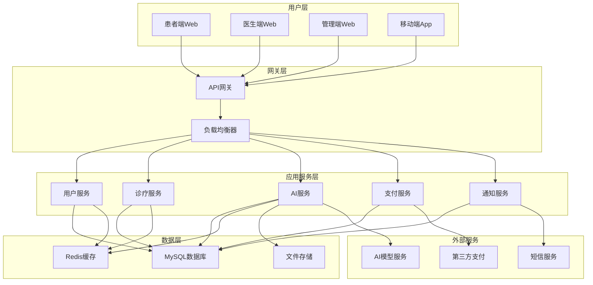
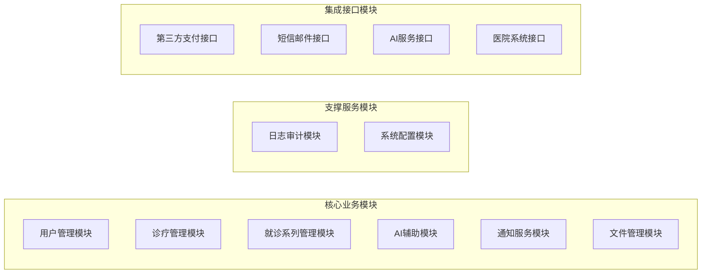
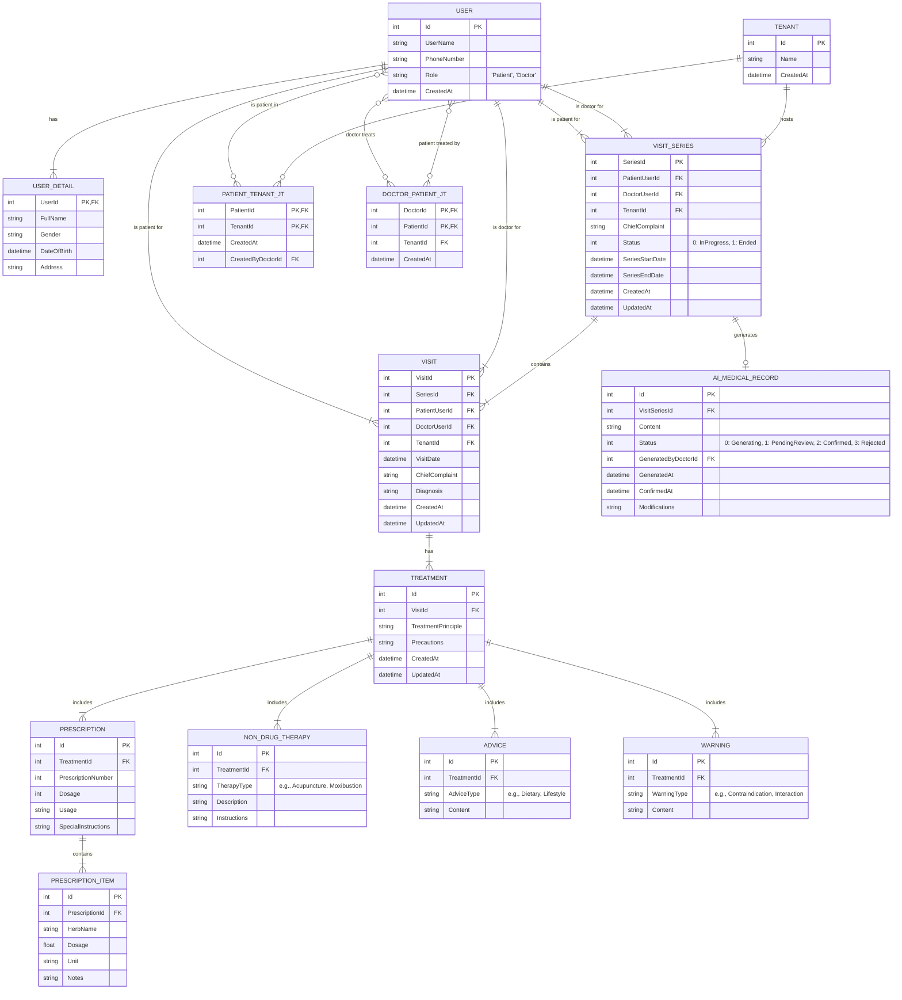
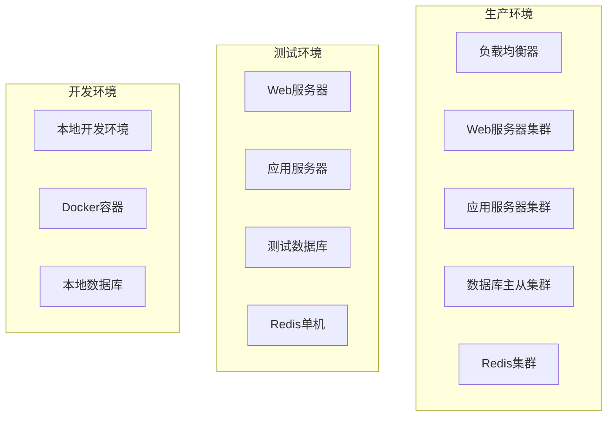

# 中医数字化诊疗平台概要设计说明书（SDD）

## 1. 引言

### 1.1 编写目的
本文档旨在为中医数字化诊疗平台提供完整的概要设计方案，描述系统的整体架构、模块划分、技术选型和接口设计，为详细设计和开发实现提供指导。

### 1.2 项目背景
中医数字化诊疗平台是一个集成了人工智能技术的现代化中医诊疗系统，旨在提升中医诊疗效率，传承和发展中医药文化，为患者提供便捷、专业的中医诊疗服务。

### 1.3 文档范围
本文档涵盖系统的整体设计方案，包括：
- 系统总体架构设计
- 功能模块划分
- 技术选型方案
- 数据库概念设计
- 接口设计概要


### 1.4 参考文档
- 《需求分析说明书》
- 《需求规格说明书》
- 《用户故事和用例文档》
- 《项目待办事项清单》
- 《系统架构设计说明书》
- 《技术选型报告》

## 2. 系统概述

### 2.1 系统目标
- **提升诊疗效率**：通过AI辅助诊断，提高中医诊疗的准确性和效率
- **知识传承**：数字化中医诊疗经验，促进中医药知识的传承和发展
- **服务便民**：提供在线问诊、预约挂号等便民服务
- **数据驱动**：基于大数据分析，优化诊疗方案和医疗资源配置

### 2.2 系统特点
- **多租户架构**：支持医院、诊所、个人医生等不同类型的租户
- **AI智能化**：集成症状分析、图像识别、智能问答等AI功能
- **中医特色**：专门针对中医诊疗流程和特点进行设计
- **云原生**：采用微服务架构，支持容器化部署和弹性扩展

### 2.3 用户角色
- **患者**：接受诊疗服务的用户
- **医生**：提供诊疗服务的中医师
- **管理员**：系统管理和运维人员
- **租户管理员**：医院或诊所的管理人员

## 3. 系统总体架构

### 3.1 架构概览



### 3.2 架构层次说明

#### 3.2.1 用户层（Presentation Layer）
- **患者端Web**：患者使用的Web界面，提供预约、问诊、查看报告等功能
- **医生端Web**：医生使用的Web界面，提供诊疗、开方、患者管理等功能
- **管理端Web**：系统管理员使用的Web界面，提供用户管理、系统配置等功能
- **移动端App**：移动应用，提供便捷的移动端服务

#### 3.2.2 网关层（Gateway Layer）
- **API网关**：统一入口，提供路由、认证、限流、监控等功能
- **负载均衡器**：分发请求，确保系统高可用性

#### 3.2.3 应用服务层（Application Service Layer）
- **用户服务**：用户注册、登录、权限管理
- **诊疗服务**：就诊记录、诊断、处方管理
- **AI服务**：症状分析、图像识别、智能问答
- **支付服务**：费用计算、支付处理、账单管理
- **通知服务**：消息推送、短信通知、邮件发送

#### 3.2.4 数据层（Data Layer）
- **MySQL数据库**：主要业务数据存储
- **Redis缓存**：热点数据缓存，提升性能
- **文件存储**：图片、文档等文件存储

#### 3.2.5 外部服务（External Services）
- **第三方支付**：微信支付、支付宝等支付接口
- **短信服务**：短信验证码、通知短信
- **AI模型服务**：外部AI模型推理服务

## 4. 功能模块设计

### 4.1 模块划分



### 4.2 核心模块详细设计

#### 4.2.1 治疗方案模块

**功能职责**：
- **综合治疗方案**：创建和管理包含中药处方、非药物疗法、医嘱和风险警告的综合治疗方案。
- **中药处方管理**：支持医生开具、编辑、删除中药处方。
- **非药物疗法管理**：支持针灸、推拿、拔罐等非药物疗法的记录。
- **医嘱管理**：提供饮食、生活方式及复诊建议。
- **风险与禁忌警告**：自动或手动添加与方案相关的风险警告。
- **关联就诊记录**：治疗方案必须与某次具体的就诊记录关联。

**技术实现**：
- **前端**：ASP.NET Core Razor, Bootstrap 5, Vue3 (用于动态组件)。
- **后端**：C# .NET 8, MediatR for CQRS, FluentValidation for validation, EF Core for database operations.

**核心数据模型**：
- `Treatment` (治疗方案)
- `Prescription` (中药处方)
- `PrescriptionItem` (处方项)
- `NonDrugTherapy` (非药物疗法)
- `Advice` (医嘱)
- `Warning` (风险警告)

#### 4.2.2 用户管理模块

**功能职责**：
- 用户注册、登录、注销
- 用户信息管理
- 权限控制和角色管理
- 多租户管理

**主要组件**：
```csharp
// 用户服务接口
public interface IUserService
{
    Task<UserDto> RegisterAsync(RegisterRequest request);
    Task<LoginResult> LoginAsync(LoginRequest request);
    Task<UserDto> GetUserProfileAsync(int userId);
    Task<bool> UpdateUserProfileAsync(int userId, UpdateUserRequest request);
    Task<bool> ChangePasswordAsync(int userId, ChangePasswordRequest request);
}

// 租户服务接口
public interface ITenantService
{
    Task<TenantDto> CreateTenantAsync(CreateTenantRequest request);
    Task<TenantDto> GetTenantAsync(int tenantId);
    Task<List<TenantDto>> GetUserTenantsAsync(int userId);
    Task<bool> AddUserToTenantAsync(int tenantId, int userId, string role);
}
```

#### 4.2.2 诊疗管理模块

**功能职责**：
- 管理患者的完整就诊流程，从初诊到复诊，并围绕"就诊系列"进行组织。
- 记录每次就诊的详细信息，包括四诊、诊断、处方等。
- 自动或手动管理就诊系列的状态，例如，当患者超过90天未复诊时，系统可自动结束其当前就诊系列。
- 支持跨租户患者管理，医生可通过手机号搜索并添加平台已存在但未关联到本租户的患者。
- 实现患者基础信息的跨租户共享，同时保持病历数据的租户隔离。

**核心概念：就诊系列（Visit Series）**

就诊系列是本系统的核心概念，它代表了患者针对某一特定主诉的连续治疗过程。一个就诊系列包含一次或多次就诊记录（Visit）。

- **开启**：当患者因新的主诉首次就诊时，系统将自动创建一个新的就诊系列。
- **进行中**：在系列内，医生可以添加多次复诊记录。
- **结束**：当治疗完成，或患者长时间未复诊时，系列将被标记为“已结束”。

**状态定义**：
- `Status = 0`：进行中 (In-Progress)
- `Status = 1`：已结束 (Ended)

**主要组件**：
```csharp
// 就诊领域服务 (VisitDomain)
public class VisitDomain
{
    // 添加单条就诊记录（自动处理序列创建或关联）
    public async Task AddVisitAsync(Visit newVisit, int currentDoctorId, int currentTenantId);

    // 结束就诊系列
    public async Task EndSeriesAsync(int seriesId, string endReason, int operatorUserId);

    // 更新患者所有未结束的就诊系列为已结束状态
    public async Task UpdatePatientActiveSeriesAsync(int patientId, int tenantId, DateTime endDate);
}

// 就诊系列自动结束后台服务 (VisitSeriesAutoEndService)
public class VisitSeriesAutoEndService : BackgroundService
{
    // 定期检查并自动结束长时间（如90天）无活动的就诊系列
    protected override async Task ExecuteAsync(CancellationToken stoppingToken);
}

// 跨租户患者管理服务接口
public interface ICrossTenantPatientService
{
    Task<PatientDto> SearchPatientByPhoneAsync(string phoneNumber);
    Task<bool> AddExistingPatientToTenantAsync(int patientUserId, int tenantId, int doctorId);
    Task<List<PatientDto>> GetPatientsByTenantAsync(int tenantId);
    Task<bool> SyncPatientBasicInfoAsync(int patientUserId, UpdatePatientRequest request);
}
```

#### 4.2.5 就诊系列管理模块

**功能职责**：
- 管理患者就诊系列的完整生命周期
- 智能分析主诉相似度，提供系列关联建议
- 确保就诊系列状态的一致性和事务性
- 提供就诊系列的统一视图和管理界面

**主要组件**：
```csharp
// 就诊系列管理服务接口
public interface IVisitSeriesService
{
    Task<VisitSeriesDto> CreateVisitSeriesAsync(CreateVisitSeriesRequest request);
    Task<VisitSeriesDto> GetActiveSeriesByPatientAsync(int patientId, int tenantId);
    Task<bool> EndVisitSeriesAsync(int seriesId, string endReason, int operatorUserId);
    Task<List<VisitSeriesDto>> GetPatientVisitSeriesAsync(int patientId, int tenantId);
    Task<bool> CheckMainComplaintSimilarityAsync(string newComplaint, int patientId, int tenantId);
}

// 就诊系列状态管理
public enum VisitSeriesStatus
{
    InProgress = 0,    // 进行中
    Ended = 1,         // 已结束
    Paused = 2         // 已暂停
}
```

#### 4.2.6 AI医案生成模块

**功能职责**：
- 基于就诊系列自动生成标准化AI医案
- 提供证候演变分析和治疗效果评估
- 支持医生审核、修改和确认AI医案
- 维护AI医案的版本历史和状态管理
- 智能分析患者病情发展趋势
- 提供个性化治疗方案建议

**核心流程**：
1. **自动触发**：就诊系列结束或医生手动触发时自动生成
2. **数据收集**：收集患者完整就诊系列数据，包括症状、诊断、处方等
3. **AI分析**：调用AI服务进行证候分析、病情演变分析和疗效评估
4. **医案生成**：基于分析结果生成结构化医案内容
5. **医生审核**：医生查看、编辑和确认AI生成的医案
6. **版本管理**：记录医案修改历史和审核过程

**主要组件**：
```csharp
// AI医案生成服务接口
public interface IAiMedicalRecordService
{
    Task<AiMedicalRecordDto> GenerateRecordAsync(int visitSeriesId);
    Task<AiMedicalRecordDto> GetRecordBySeriesAsync(int visitSeriesId);
    Task<bool> ConfirmRecordAsync(int recordId, int doctorId, string modifications);
    Task<List<AiMedicalRecordDto>> GetRecordsByPatientAsync(int patientId, int tenantId);
    Task<bool> RegenerateRecordAsync(int recordId, int doctorId);
    Task<AiMedicalRecordDto> UpdateRecordAsync(int recordId, UpdateAiMedicalRecordRequest request);
    Task<List<AiMedicalRecordHistoryDto>> GetRecordHistoryAsync(int recordId);
    Task<SyndromeAnalysisDto> AnalyzeSyndromeEvolutionAsync(int visitSeriesId);
}

// AI医案状态枚举
public enum AiMedicalRecordStatus
{
    Generating = 0,     // 生成中
    PendingReview = 1,  // 待审核
    Confirmed = 2,      // 已确认
    Rejected = 3        // 已拒绝
}

// AI医案数据传输对象
public class AiMedicalRecordDto
{
    public int Id { get; set; }
    public int VisitSeriesId { get; set; }
    public string Title { get; set; }
    public string PatientSummary { get; set; }
    public string SyndromeAnalysis { get; set; }
    public string TreatmentEvolution { get; set; }
    public string EffectivenessEvaluation { get; set; }
    public string ClinicalInsights { get; set; }
    public AiMedicalRecordStatus Status { get; set; }
    public string DoctorModifications { get; set; }
    public DateTime GeneratedAt { get; set; }
    public DateTime? ConfirmedAt { get; set; }
    public int Version { get; set; }
}

// 证候演变分析结果
public class SyndromeAnalysisDto
{
    public string InitialSyndrome { get; set; }
    public string FinalSyndrome { get; set; }
    public List<SyndromeEvolutionStage> EvolutionStages { get; set; }
    public string TreatmentEffectiveness { get; set; }
    public List<string> KeyTreatmentPoints { get; set; }
}
```

#### 4.2.3 AI辅助模块

**功能职责**：
- 症状分析和诊断建议
- 医学图像识别
- 智能问答
- 处方推荐

**主要组件**：
```csharp
// AI诊断服务接口
public interface IAiDiagnosisService
{
    Task<SymptomAnalysisResult> AnalyzeSymptomsAsync(SymptomAnalysisRequest request);
    Task<ImageAnalysisResult> AnalyzeImageAsync(ImageAnalysisRequest request);
    Task<ChatResponse> ChatAsync(ChatRequest request);
    Task<PrescriptionSuggestion> SuggestPrescriptionAsync(PrescriptionRequest request);
}

// AI模型管理服务接口
public interface IAiModelService
{
    Task<ModelInfo> GetModelInfoAsync(string modelType);
    Task<bool> UpdateModelAsync(string modelType, string version);
    Task<ModelPerformance> GetModelPerformanceAsync(string modelType);
}
```

#### 4.2.4 支付管理模块

**功能职责**：
- 费用计算
- 支付处理
- 账单管理
- 退款处理

**主要组件**：
```csharp
// 支付服务接口
public interface IPaymentService
{
    Task<PaymentOrder> CreatePaymentOrderAsync(CreatePaymentOrderRequest request);
    Task<PaymentResult> ProcessPaymentAsync(ProcessPaymentRequest request);
    Task<RefundResult> ProcessRefundAsync(ProcessRefundRequest request);
    Task<List<PaymentRecord>> GetPaymentHistoryAsync(int userId);
}

// 费用计算服务接口
public interface IBillingService
{
    Task<BillingInfo> CalculateVisitFeeAsync(int visitId);
    Task<BillingInfo> CalculateConsultationFeeAsync(ConsultationFeeRequest request);
    Task<List<FeeItem>> GetFeeItemsAsync(int tenantId);
}
```

## 5. 技术选型

### 5.1 技术栈概览

| 技术分类 | 选择方案 | 版本 | 说明 |
|----------|----------|------|------|
| **后端框架** | ASP.NET Core | 8.0 | 高性能、跨平台的Web框架 |
| **数据库** | MySQL | 8.0 | 开源关系型数据库 |
| **缓存** | Redis | 7.0 | 内存数据库，提升性能 |
| **消息队列** | RabbitMQ | 3.12 | 可靠的消息中间件 |
| **前端框架** | Vue.js | 3.x | 渐进式JavaScript框架 |
| **移动端** | Flutter | 3.x | 跨平台移动应用开发框架 |
| **容器化** | Docker | 24.x | 应用容器化部署 |
| **编排** | Kubernetes | 1.28 | 容器编排和管理 |
| **AI框架** | TensorFlow.NET | 2.x | .NET平台的机器学习框架 |

### 5.2 架构模式选择

#### 5.2.1 领域驱动设计（DDD）
```csharp
// 领域模型示例
public class Patient : AggregateRoot<int>
{
    public string FullName { get; private set; }
    public string PhoneNumber { get; private set; }
    public DateTime DateOfBirth { get; private set; }
    public Gender Gender { get; private set; }
    
    // 领域方法
    public Visit CreateVisit(Doctor doctor, DateTime appointmentTime)
    {
        // 业务逻辑验证
        if (appointmentTime <= DateTime.Now)
            throw new DomainException("预约时间不能是过去时间");
            
        return new Visit(this.Id, doctor.Id, appointmentTime);
    }
}
```

#### 5.2.2 CQRS模式
```csharp
// 命令处理器
public class CreatePatientCommandHandler : IRequestHandler<CreatePatientCommand, PatientDto>
{
    public async Task<PatientDto> Handle(CreatePatientCommand request, CancellationToken cancellationToken)
    {
        // 创建患者逻辑
    }
}

// 查询处理器
public class GetPatientQueryHandler : IRequestHandler<GetPatientQuery, PatientDto>
{
    public async Task<PatientDto> Handle(GetPatientQuery request, CancellationToken cancellationToken)
    {
        // 查询患者逻辑
    }
}
```

## 6. 数据库概念设计

### 6.1 核心实体关系图



### 6.2 数据库设计原则

#### 6.2.1 命名规范
- **表名**：使用复数形式，如 `Users`、`Patients`、`Visits`
- **字段名**：使用PascalCase命名，如 `FullName`、`PhoneNumber`
- **主键**：统一使用 `Id` 作为主键名
- **外键**：使用 `{表名}Id` 格式，如 `PatientId`、`DoctorId`

#### 6.2.2 数据类型选择
```sql
-- 用户表设计示例
CREATE TABLE Users (
    Id INT AUTO_INCREMENT PRIMARY KEY,
    UserName NVARCHAR(50) NOT NULL UNIQUE,
    Email NVARCHAR(100) NOT NULL UNIQUE,
    PhoneNumber NVARCHAR(20) NOT NULL,
    PasswordHash NVARCHAR(255) NOT NULL,
    CreatedAt DATETIME NOT NULL DEFAULT CURRENT_TIMESTAMP,
    UpdatedAt DATETIME NOT NULL DEFAULT CURRENT_TIMESTAMP ON UPDATE CURRENT_TIMESTAMP,
    IsActive BOOLEAN NOT NULL DEFAULT TRUE,
    
    INDEX IX_Users_Email (Email),
    INDEX IX_Users_PhoneNumber (PhoneNumber)
);
```

## 7. 接口设计概要

### 7.1 RESTful API设计原则

#### 7.1.1 URL设计规范
```
GET    /api/v1/patients           # 获取患者列表
GET    /api/v1/patients/{id}      # 获取特定患者
POST   /api/v1/patients           # 创建新患者
PUT    /api/v1/patients/{id}      # 更新患者信息
DELETE /api/v1/patients/{id}      # 删除患者

GET    /api/v1/patients/{id}/visits     # 获取患者就诊记录
POST   /api/v1/patients/{id}/visits     # 创建就诊记录
```

#### 7.1.2 响应格式标准
```json
{
  "success": true,
  "code": "0000",
  "message": "操作成功",
  "data": {
    "id": 1,
    "fullName": "张三",
    "phoneNumber": "13800138000",
    "dateOfBirth": "1980-01-01",
    "gender": "Male"
  },
  "timestamp": "2024-01-15T10:30:00Z"
}
```

### 7.2 主要接口分组

#### 7.2.1 用户管理接口
```csharp
[ApiController]
[Route("api/v1/[controller]")]
public class UsersController : ControllerBase
{
    [HttpPost("register")]
    public async Task<ActionResult<ApiResponse<UserDto>>> Register([FromBody] RegisterRequest request);
    
    [HttpPost("login")]
    public async Task<ActionResult<ApiResponse<LoginResult>>> Login([FromBody] LoginRequest request);
    
    [HttpGet("profile")]
    [Authorize]
    public async Task<ActionResult<ApiResponse<UserDto>>> GetProfile();
    
    [HttpPut("profile")]
    [Authorize]
    public async Task<ActionResult<ApiResponse<bool>>> UpdateProfile([FromBody] UpdateUserRequest request);
}
```

#### 7.2.2 诊疗管理接口
```csharp
[ApiController]
[Route("api/v1/[controller]")]
public class PatientsController : ControllerBase
{
    [HttpGet]
    public async Task<ActionResult<ApiResponse<PagedResult<PatientDto>>>> GetPatients([FromQuery] SearchPatientsRequest request);
    
    [HttpGet("{id}")]
    public async Task<ActionResult<ApiResponse<PatientDto>>> GetPatient(int id);
    
    [HttpPost]
    public async Task<ActionResult<ApiResponse<PatientDto>>> CreatePatient([FromBody] CreatePatientRequest request);
    
    [HttpPut("{id}")]
    public async Task<ActionResult<ApiResponse<bool>>> UpdatePatient(int id, [FromBody] UpdatePatientRequest request);
    
    [HttpGet("search-by-phone/{phoneNumber}")]
    public async Task<ActionResult<ApiResponse<PatientDto>>> SearchPatientByPhone(string phoneNumber);
    
    [HttpPost("add-existing")]
    public async Task<ActionResult<ApiResponse<bool>>> AddExistingPatient([FromBody] AddExistingPatientRequest request);
}

[ApiController]
[Route("api/v1/visit-series")]
public class VisitSeriesController : ControllerBase
{
    [HttpGet("patient/{patientId}/active")]
    public async Task<ActionResult<ApiResponse<VisitSeriesDto>>> GetActiveSeriesByPatient(int patientId);
    
    [HttpPost]
    public async Task<ActionResult<ApiResponse<VisitSeriesDto>>> CreateVisitSeries([FromBody] CreateVisitSeriesRequest request);
    
    [HttpPut("{seriesId}/end")]
    public async Task<ActionResult<ApiResponse<bool>>> EndVisitSeries(int seriesId, [FromBody] EndVisitSeriesRequest request);
    
    [HttpGet("patient/{patientId}")]
    public async Task<ActionResult<ApiResponse<List<VisitSeriesDto>>>> GetPatientVisitSeries(int patientId);
}

[ApiController]
[Route("api/v1/ai-medical-records")]
public class AiMedicalRecordsController : ControllerBase
{
    [HttpPost("generate")]
    public async Task<ActionResult<ApiResponse<AiMedicalRecordDto>>> GenerateRecord([FromBody] GenerateRecordRequest request);
    
    [HttpGet("series/{seriesId}")]
    public async Task<ActionResult<ApiResponse<AiMedicalRecordDto>>> GetRecordBySeries(int seriesId);
    
    [HttpPut("{recordId}/confirm")]
    public async Task<ActionResult<ApiResponse<bool>>> ConfirmRecord(int recordId, [FromBody] ConfirmRecordRequest request);
    
    [HttpGet("patient/{patientId}")]
    public async Task<ActionResult<ApiResponse<List<AiMedicalRecordDto>>>> GetRecordsByPatient(int patientId);
    
    [HttpPut("{recordId}")]
    public async Task<ActionResult<ApiResponse<AiMedicalRecordDto>>> UpdateRecord(int recordId, [FromBody] UpdateAiMedicalRecordRequest request);
    
    [HttpPost("{recordId}/regenerate")]
    public async Task<ActionResult<ApiResponse<AiMedicalRecordDto>>> RegenerateRecord(int recordId);
    
    [HttpGet("{recordId}/history")]
    public async Task<ActionResult<ApiResponse<List<AiMedicalRecordHistoryDto>>>> GetRecordHistory(int recordId);
    
    [HttpPost("syndrome-analysis")]
    public async Task<ActionResult<ApiResponse<SyndromeAnalysisDto>>> AnalyzeSyndromeEvolution([FromBody] SyndromeAnalysisRequest request);
    
    [HttpGet("tenant/{tenantId}/statistics")]
    public async Task<ActionResult<ApiResponse<AiMedicalRecordStatisticsDto>>> GetTenantStatistics(int tenantId);
}
```

#### 7.2.3 AI服务接口
```csharp
[ApiController]
[Route("api/v1/ai")]
public class AiController : ControllerBase
{
    [HttpPost("symptom-analysis")]
    public async Task<ActionResult<ApiResponse<SymptomAnalysisResult>>> AnalyzeSymptoms([FromBody] SymptomAnalysisRequest request);
    
    [HttpPost("image-analysis")]
    public async Task<ActionResult<ApiResponse<ImageAnalysisResult>>> AnalyzeImage([FromForm] ImageAnalysisRequest request);
    
    [HttpPost("chat")]
    public async Task<ActionResult<ApiResponse<ChatResponse>>> Chat([FromBody] ChatRequest request);
}
```

## 8. 部署架构设计

### 8.1 部署环境规划

#### 8.1.1 环境分层


#### 8.1.2 容器化部署
```yaml
# docker-compose.yml
version: '3.8'
services:
  web:
    image: tcm-platform-web:latest
    ports:
      - "80:80"
      - "443:443"
    depends_on:
      - api
      
  api:
    image: tcm-platform-api:latest
    ports:
      - "5000:80"
    environment:
      - ConnectionStrings__DefaultConnection=Server=db;Database=TcmPlatform;
      - Redis__ConnectionString=redis:6379
    depends_on:
      - db
      - redis
      
  db:
    image: mysql:8.0
    environment:
      - MYSQL_ROOT_PASSWORD=rootpassword
      - MYSQL_DATABASE=TcmPlatform
    volumes:
      - mysql_data:/var/lib/mysql
      
  redis:
    image: redis:7.0
    ports:
      - "6379:6379"
      
volumes:
  mysql_data:
```

### 8.2 高可用性设计

#### 8.2.1 负载均衡配置
```nginx
upstream api_servers {
    server api1:5000 weight=3;
    server api2:5000 weight=3;
    server api3:5000 weight=2;
}

server {
    listen 80;
    server_name api.tcmplatform.com;
    
    location / {
        proxy_pass http://api_servers;
        proxy_set_header Host $host;
        proxy_set_header X-Real-IP $remote_addr;
        proxy_set_header X-Forwarded-For $proxy_add_x_forwarded_for;
    }
}
```

#### 8.2.2 数据库高可用
- **主从复制**：配置MySQL主从复制，实现读写分离
- **故障转移**：使用MHA或Orchestrator实现自动故障转移
- **备份策略**：定期全量备份和增量备份

## 9. 安全设计概要

### 9.1 身份认证和授权

#### 9.1.1 JWT Token认证
```csharp
public class JwtTokenService : IJwtTokenService
{
    public string GenerateToken(User user, List<string> roles)
    {
        var claims = new List<Claim>
        {
            new Claim(ClaimTypes.NameIdentifier, user.Id.ToString()),
            new Claim(ClaimTypes.Name, user.UserName),
            new Claim(ClaimTypes.Email, user.Email),
            new Claim("tenant_id", user.TenantId.ToString())
        };
        
        foreach (var role in roles)
        {
            claims.Add(new Claim(ClaimTypes.Role, role));
        }
        
        var key = new SymmetricSecurityKey(Encoding.UTF8.GetBytes(_jwtSettings.SecretKey));
        var credentials = new SigningCredentials(key, SecurityAlgorithms.HmacSha256);
        
        var token = new JwtSecurityToken(
            issuer: _jwtSettings.Issuer,
            audience: _jwtSettings.Audience,
            claims: claims,
            expires: DateTime.UtcNow.AddHours(_jwtSettings.ExpirationHours),
            signingCredentials: credentials
        );
        
        return new JwtSecurityTokenHandler().WriteToken(token);
    }
}
```

#### 9.1.2 权限控制
```csharp
[Authorize(Roles = "Doctor,Admin")]
public class DiagnosisController : ControllerBase
{
    [HttpPost]
    [RequirePermission("CreateDiagnosis")]
    public async Task<ActionResult> CreateDiagnosis([FromBody] CreateDiagnosisRequest request)
    {
        // 诊断创建逻辑
    }
}
```

### 9.2 数据安全

#### 9.2.1 敏感数据加密
```csharp
public class DataEncryptionService : IDataEncryptionService
{
    public string EncryptSensitiveData(string data)
    {
        using var aes = Aes.Create();
        aes.Key = Convert.FromBase64String(_encryptionSettings.Key);
        aes.IV = Convert.FromBase64String(_encryptionSettings.IV);
        
        using var encryptor = aes.CreateEncryptor();
        using var msEncrypt = new MemoryStream();
        using var csEncrypt = new CryptoStream(msEncrypt, encryptor, CryptoStreamMode.Write);
        using var swEncrypt = new StreamWriter(csEncrypt);
        
        swEncrypt.Write(data);
        return Convert.ToBase64String(msEncrypt.ToArray());
    }
}
```

## 10. 性能设计概要

### 10.1 缓存策略

#### 10.1.1 多级缓存架构
```csharp
public class CacheService : ICacheService
{
    private readonly IMemoryCache _memoryCache;
    private readonly IDistributedCache _distributedCache;
    
    public async Task<T> GetAsync<T>(string key)
    {
        // 1. 先查内存缓存
        if (_memoryCache.TryGetValue(key, out T value))
        {
            return value;
        }
        
        // 2. 再查分布式缓存
        var distributedValue = await _distributedCache.GetStringAsync(key);
        if (!string.IsNullOrEmpty(distributedValue))
        {
            value = JsonSerializer.Deserialize<T>(distributedValue);
            _memoryCache.Set(key, value, TimeSpan.FromMinutes(5));
            return value;
        }
        
        return default(T);
    }
}
```

### 10.2 数据库优化

#### 10.2.1 索引策略
```sql
-- 患者表索引
CREATE INDEX IX_Patients_PhoneNumber ON Patients(PhoneNumber);
CREATE INDEX IX_Patients_TenantId_CreatedAt ON Patients(TenantId, CreatedAt);

-- 就诊记录表索引
CREATE INDEX IX_Visits_PatientId_AppointmentTime ON Visits(PatientId, AppointmentTime);
CREATE INDEX IX_Visits_DoctorId_Status ON Visits(DoctorId, Status);
```

## 11. 监控和日志设计

### 11.1 应用监控

#### 11.1.1 健康检查
```csharp
public class DatabaseHealthCheck : IHealthCheck
{
    private readonly IDbContext _context;
    
    public async Task<HealthCheckResult> CheckHealthAsync(HealthCheckContext context, CancellationToken cancellationToken = default)
    {
        try
        {
            await _context.Database.ExecuteSqlRawAsync("SELECT 1", cancellationToken);
            return HealthCheckResult.Healthy("数据库连接正常");
        }
        catch (Exception ex)
        {
            return HealthCheckResult.Unhealthy("数据库连接失败", ex);
        }
    }
}
```

### 11.2 日志记录

#### 11.2.1 结构化日志
```csharp
public class DiagnosisService : IDiagnosisService
{
    private readonly ILogger<DiagnosisService> _logger;
    
    public async Task<DiagnosisResult> CreateDiagnosisAsync(CreateDiagnosisRequest request)
    {
        _logger.LogInformation("开始创建诊断 - 患者ID: {PatientId}, 医生ID: {DoctorId}", 
            request.PatientId, request.DoctorId);
        
        try
        {
            var result = await ProcessDiagnosisAsync(request);
            
            _logger.LogInformation("诊断创建成功 - 诊断ID: {DiagnosisId}, 耗时: {ElapsedMs}ms", 
                result.Id, stopwatch.ElapsedMilliseconds);
                
            return result;
        }
        catch (Exception ex)
        {
            _logger.LogError(ex, "诊断创建失败 - 患者ID: {PatientId}", request.PatientId);
            throw;
        }
    }
}
```

### 11.3 后台服务配置

#### 11.3.1 就诊系列自动结束服务配置
```json
{
  "VisitSeriesAutoEnd": {
    "Enabled": true,
    "CheckIntervalMinutes": 60,
    "AutoEndDaysThreshold": 30,
    "BatchSize": 100,
    "MaxRetryAttempts": 3
  },
  "AiMedicalRecordGeneration": {
    "Enabled": true,
    "AutoTriggerAfterVisit": true,
    "AutoTriggerAfterSeriesEnd": true,
    "GenerationTimeoutMinutes": 10,
    "MaxConcurrentGenerations": 5,
    "RetryAttempts": 3,
    "RetryDelayMinutes": 5,
    "EnableSyndromeAnalysis": true,
    "EnableTreatmentEvaluation": true,
    "MinVisitsForGeneration": 1
  }
}
```

#### 11.3.2 后台服务监控
```csharp
public class BackgroundServiceHealthCheck : IHealthCheck
{
    private readonly IServiceProvider _serviceProvider;
    
    public async Task<HealthCheckResult> CheckHealthAsync(HealthCheckContext context, CancellationToken cancellationToken = default)
    {
        try
        {
            // 检查后台服务状态
            var hostedServices = _serviceProvider.GetServices<IHostedService>();
            var unhealthyServices = new List<string>();
            
            foreach (var service in hostedServices)
            {
                if (service is BackgroundService backgroundService)
                {
                    // 检查服务是否正常运行
                    var serviceType = service.GetType().Name;
                    // 实现具体的健康检查逻辑
                }
            }
            
            return unhealthyServices.Any() 
                ? HealthCheckResult.Unhealthy($"后台服务异常: {string.Join(", ", unhealthyServices)}")
                : HealthCheckResult.Healthy("所有后台服务正常运行");
        }
        catch (Exception ex)
        {
            return HealthCheckResult.Unhealthy("后台服务健康检查失败", ex);
        }
    }
}
```

## 12. 总结

本概要设计说明书为中医数字化诊疗平台提供了完整的系统设计方案，涵盖了架构设计、模块划分、技术选型、数据库设计、接口设计等各个方面。

### 12.1 设计特点
1. **模块化设计**：采用DDD分层架构，模块职责清晰
2. **技术先进**：使用.NET 8、微服务架构等现代技术
3. **扩展性强**：支持多租户、容器化部署
4. **安全可靠**：完善的安全机制和监控体系

### 12.2 后续工作
1. **详细设计**：基于本概要设计，编写详细设计文档
2. **原型开发**：开发核心功能原型，验证设计方案
3. **技术预研**：对关键技术进行深入研究和验证
4. **团队培训**：对开发团队进行技术培训

本设计方案为项目的成功实施奠定了坚实的基础，确保系统能够满足业务需求并具备良好的可维护性和扩展性。