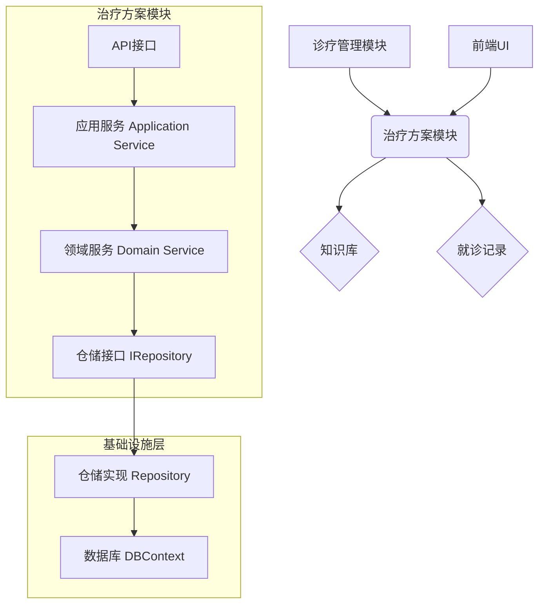

# 系统架构设计说明书

## 1. 引言

本文档旨在详细阐述中医数字化诊疗平台的系统架构设计，为后续的开发、测试和运维提供清晰的指导。

## 2. 系统概述

本平台是一个基于 .NET Core 的智能化中医数字化诊疗平台，旨在为中医诊所提供一套完整的数字化诊疗解决方案。平台集成了传统的患者管理、就诊管理、电子病历、多租户管理功能，并创新性地融入了AI辅助诊断、智能医案生成、就诊系列管理和中医知识库等智能化功能，为中医诊疗的现代化和标准化提供技术支撑。

## 3. 技术选型

### 3.1 基础技术栈
- **后端框架**: .NET 8
- **前端技术**: Razor Pages + Bootstrap 5 + PlainAdmin
- **数据库**: MySQL 8.0
- **ORM**: Entity Framework Core 8
- **用户认证**: ASP.NET Core Identity
- **容器化**: Docker

### 3.2 AI技术栈
- **机器学习框架**: TensorFlow.NET / ML.NET
- **自然语言处理**: 中文分词、文本分类、实体识别
- **知识图谱**: Neo4j / 关系型数据库存储
- **AI服务**: RESTful API 接口
- **模型部署**: Docker容器化部署

### 3.3 数据处理
- **缓存**: Redis
- **消息队列**: RabbitMQ（可选）
- **文件存储**: 本地文件系统 / 云存储
- **日志**: Serilog

## 4. 架构设计

本系统采用经典的领域驱动设计（DDD）分层架构，并集成AI服务模块，将系统划分为以下几个核心项目：

### 4.1 治疗方案模块架构
治疗方案模块作为核心业务的一部分，将紧密集成在 `TcmAiDiagnosis.Domain` 层中，并与多个其他模块进行交互。

**组件关系**:


**交互说明**：
- **诊疗管理模块**：在医生完成诊断后，调用治疗方案模块来创建和管理治疗方案。
- **知识库**：治疗方案模块在推荐方剂、检查配伍禁忌时，需要查询知识库中的药品信息和规则。
- **就诊记录**：生成的治疗方案（`TreatmentPlan`）会与当前的就诊记录（`Visit`）进行关联。
- **前端UI**：通过API与后端交互，提供方案录入、展示和修改的用户界面。

### 4.2 核心业务层
- **TcmAiDiagnosis.Entities**: 核心实体层，定义了系统中的所有业务实体，如 `User`, `Tenant`, `Visit`, `TreatmentPlan`, `Prescription`, `KnowledgeBase`, `DiagnosisRecord` 等。
- **TcmAiDiagnosis.Domain**: 领域服务层，封装了系统的核心业务逻辑，如患者管理、就诊流程、治疗方案制定、租户管理、知识库管理等。
- **TcmAiDiagnosis.Dtos**: 数据传输对象层，用于在不同层之间传递数据，避免直接暴露领域实体。

### 4.2 数据访问层
- **TcmAiDiagnosis.EFContext**: 基础设施层，负责数据持久化，通过 Entity Framework Core 将领域实体映射到数据库表。

### 4.3 AI服务层
- **TcmAiDiagnosis.AI**: AI算法服务层，包含：
  - **DiagnosisService**: AI辅助诊断服务
  - **MedicalRecordGenerationService**: 智能医案生成服务
  - **KnowledgeBaseService**: 知识库查询和推理服务
  - **NLPService**: 自然语言处理服务

### 4.4 表现层
- **TcmAiDiagnosis.Web**: 表现层，负责处理用户请求和展示用户界面，采用 Razor Pages 技术构建，集成AI功能界面。

### 4.5 系统架构图
```
┌─────────────────────────────────────────────────────────────┐
│                    表现层 (Web)                              │
│  ┌─────────────┐ ┌─────────────┐ ┌─────────────┐           │
│  │  患者管理   │ │  诊疗管理   │ │  AI辅助诊断 │           │
│  └─────────────┘ └─────────────┘ └─────────────┘           │
└─────────────────────────────────────────────────────────────┘
                              │
┌─────────────────────────────────────────────────────────────┐
│                    应用服务层                                │
│  ┌─────────────┐ ┌─────────────┐ ┌─────────────┐           │
│  │  业务逻辑   │ │  AI服务     │ │  知识库服务 │           │
│  └─────────────┘ └─────────────┘ └─────────────┘           │
└─────────────────────────────────────────────────────────────┘
                              │
┌─────────────────────────────────────────────────────────────┐
│                    领域层 (Domain)                          │
│  ┌─────────────┐ ┌─────────────┐ ┌─────────────┐           │
│  │  患者领域   │ │  就诊领域   │ │  知识库领域 │           │
│  └─────────────┘ └─────────────┘ └─────────────┘           │
└─────────────────────────────────────────────────────────────┘
                              │
┌─────────────────────────────────────────────────────────────┐
│                    基础设施层                                │
│  ┌─────────────┐ ┌─────────────┐ ┌─────────────┐           │
│  │  数据库     │ │  缓存       │ │  AI模型     │           │
│  │  (MySQL)    │ │  (Redis)    │ │  (TensorFlow)│          │
│  └─────────────┘ └─────────────┘ └─────────────┘           │
└─────────────────────────────────────────────────────────────┘
```

## 5. 数据库设计

数据库设计遵循第三范式，关键实体包括：

### 5.1 基础实体
- **Users**: 存储所有用户信息，包括患者、医生、管理员和知识管理员。
- **Tenants**: 实现多租户功能，隔离不同诊所的数据。
- **Visits** 和 **VisitSeries**: 记录患者的就诊信息和就诊历史，支持就诊系列管理。
- **Roles**: 基于 ASP.NET Core Identity 实现角色管理。

### 5.2 AI相关实体
- **DiagnosisRecords**: 存储AI诊断记录，包括症状、诊断结果、置信度等。
- **MedicalRecords**: 智能生成的医案记录，包括四诊信息、诊断、处方等。
- **AIModels**: AI模型管理，包括模型版本、参数、性能指标等。

### 5.3 知识库实体
- **KnowledgeBase**: 中医知识库主表，存储知识条目的基本信息。
- **KnowledgeCategories**: 知识分类，如病症、方剂、药材等。
- **KnowledgeRelations**: 知识关系表，构建知识图谱。
- **Symptoms**: 症状库，标准化症状描述。
- **Prescriptions**: 方剂库，存储经典方剂和现代方剂。
- **Herbs**: 药材库，包含药材属性、功效、用法等。

### 5.4 数据关系图
```
Users ──┐
        ├── Tenants ── Visits ── VisitSeries
        │                │
        │                ├── DiagnosisRecords
        │                └── MedicalRecords
        │
        └── KnowledgeBase ── KnowledgeCategories
                          ├── KnowledgeRelations
                          ├── Symptoms
                          ├── Prescriptions
                          └── Herbs
```

详细的数据库表结构请参考 `TcmAiDiagnosis.Entities` 项目中的实体类定义。

## 6. AI服务架构设计

### 6.1 AI服务模块架构
```
┌─────────────────────────────────────────────────────────────┐
│                    AI服务网关                                │
│  ┌─────────────┐ ┌─────────────┐ ┌─────────────┐           │
│  │  请求路由   │ │  负载均衡   │ │  API限流    │           │
│  └─────────────┘ └─────────────┘ └─────────────┘           │
└─────────────────────────────────────────────────────────────┘
                              │
┌─────────────────────────────────────────────────────────────┐
│                    AI核心服务                                │
│  ┌─────────────┐ ┌─────────────┐ ┌─────────────┐           │
│  │  诊断引擎   │ │  医案生成   │ │  知识推理   │           │
│  └─────────────┘ └─────────────┘ └─────────────┘           │
└─────────────────────────────────────────────────────────────┘
                              │
┌─────────────────────────────────────────────────────────────┐
│                    AI基础服务                                │
│  ┌─────────────┐ ┌─────────────┐ ┌─────────────┐           │
│  │  NLP处理    │ │  模型管理   │ │  特征工程   │           │
│  └─────────────┘ └─────────────┘ └─────────────┘           │
└─────────────────────────────────────────────────────────────┘
```

### 6.2 AI算法流程
1. **症状预处理**: 对用户输入的症状进行标准化和实体识别
2. **特征提取**: 从症状描述中提取关键特征
3. **知识匹配**: 在知识库中查找相关的诊断知识
4. **推理计算**: 基于机器学习模型进行诊断推理
5. **结果生成**: 生成诊断建议和置信度评分
6. **医案生成**: 基于诊断结果自动生成规范化医案

### 6.3 知识库架构
- **症状本体**: 标准化的症状描述体系
- **疾病本体**: 中医疾病分类和诊断标准
- **方剂本体**: 经典方剂和现代方剂知识
- **药材本体**: 中药材属性和配伍关系
- **推理规则**: 中医诊断的逻辑推理规则

## 7. 安全性设计

### 7.1 数据安全
- **数据加密**: 敏感数据采用AES-256加密存储
- **传输安全**: 全站HTTPS，API通信采用TLS 1.3
- **数据脱敏**: AI训练数据进行脱敏处理，保护患者隐私
- **访问控制**: 基于角色的访问控制(RBAC)，细粒度权限管理

### 7.2 AI安全
- **模型安全**: AI模型加密存储，防止模型泄露
- **输入验证**: 严格验证AI服务的输入参数，防止注入攻击
- **输出审核**: AI诊断结果需要医生确认，不能直接作为最终诊断
- **可解释性**: AI诊断过程可追溯，提供诊断依据说明

### 7.3 系统安全
- **身份认证**: 多因素认证，支持短信验证码
- **会话管理**: 安全的会话管理，防止会话劫持
- **审计日志**: 完整的操作日志记录，支持安全审计
- **防护机制**: 防SQL注入、XSS攻击、CSRF攻击

## 8. 部署架构

### 8.1 容器化部署
建议采用 Docker 容器化部署，通过 Dockerfile 将应用打包成镜像，方便在不同环境中快速部署和扩展。

### 8.2 微服务架构（可选）
对于大规模部署，可以考虑将AI服务独立部署为微服务：
- **Web服务**: 主要的Web应用服务
- **AI服务**: 独立的AI算法服务
- **知识库服务**: 知识库查询和管理服务
- **数据服务**: 数据访问和缓存服务

### 8.3 负载均衡
- **应用负载均衡**: Nginx反向代理
- **数据库负载均衡**: MySQL主从复制
- **AI服务负载均衡**: 多实例部署，轮询调度

## 9. 性能优化

### 9.1 数据库优化
- **索引优化**: 为常用查询字段建立合适的索引
- **查询优化**: 使用EF Core的查询优化技术
- **连接池**: 合理配置数据库连接池

### 9.2 缓存策略
- **Redis缓存**: 缓存热点数据和AI推理结果
- **内存缓存**: 缓存知识库数据，减少数据库查询
- **CDN**: 静态资源使用CDN加速

### 9.3 AI性能优化
- **模型优化**: 模型量化和剪枝，减少推理时间
- **批处理**: 支持批量诊断请求，提高吞吐量
- **异步处理**: AI推理采用异步处理，避免阻塞主线程