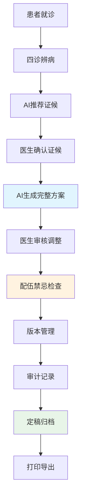
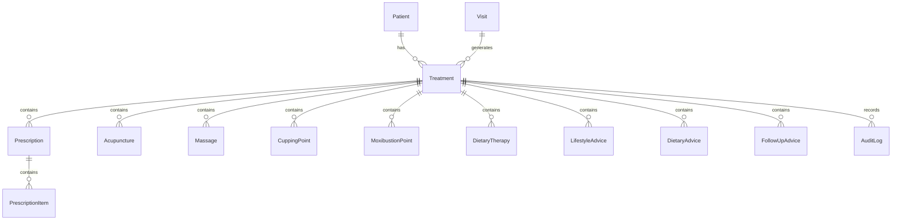

# 中医数字化诊疗平台·治疗方案模块开发计划
**最终执行版 v7.0** | 七大子计划整合版 | 全生命周期覆盖

---

## 版本修订记录

| 版本 | 日期 | 修订内容 | 状态 |
|------|------|----------|------|
| v7.0 | 2024-12-19 | 整合七大子计划，统一状态枚举，全生命周期管理 | 可执行 |
| v6.0 | 2024-12-19 | 深度上下文校验，消除冗余，优化逻辑结构 | 已废弃 |
| v5.0 | 2024-12-19 | 初始上下文校验版本 | 已废弃 |

---

## 1. 项目定位与总体架构

### 1.1 项目背景与目标

**项目定位**：构建基于七大子计划的中医数字化诊疗平台治疗方案管理系统，实现从AI智能生成到标准化交付的完整闭环。

**七大核心子计划**：
- **计划1**：实体类创建与数据库架构（基础数据层）
- **计划2**：智能治疗方案生成（AI生成层）
- **计划3**：治疗方案内容管理与编辑（医生编辑层）
- **计划4**：配伍禁忌检查（安全验证层）
- **计划5**：治疗方案版本管理（生命周期管理层）
- **计划6**：治疗方案审计与日志（合规追踪层）
- **计划7**：治疗方案打印与导出（标准化交付层）

**统一状态枚举**：
```csharp
public enum TreatmentStatus
{
    AIGenerated = 1,    // 计划2输出 → 计划3输入
    Editing = 2,        // 计划3处理中
    Checking = 3,       // 计划4处理中
    CheckFailed = 4,    // 计划4失败 → 计划3重编辑
    Versioning = 5,     // 计划5输入
    Finalized = 6,      // 计划5输出 → 计划7输入
    Archived = 7        // 计划5历史版本
}
```

**需求覆盖范围**：
- `FR-04-04` 治疗方案制定功能（计划1-7全覆盖）
- `FR-05` 病历管理相关需求（计划5+6专项支持）

### 1.2 端到端业务流程



**关键控制点验证表**：

| 控制点 | 验证要求 | 技术实现 | 合规标准 |
|--------|----------|----------|----------|
| 证候确认 | 医生必须最终确认 | 前端验证+后端强制校验 | 《中医病历规范》第12条 |
| 风险检查 | 100%配伍禁忌检查 | 实时规则引擎+二次确认 | 《药典》2020版 |
| 版本控制 | 每次修改生成新版本 | 自动版本号+历史追溯 | 医疗记录完整性要求 |
| 审计追踪 | 全操作链记录 | 统一审计服务+不可篡改 | 《电子病历管理规范》 |

### 1.3 技术架构概览

**技术栈组合**：
- **后端**：.NET 8 + EF Core 8 + MySQL 8.0
- **前端**：ASP.NET Core Razor + Bootstrap 5 + PlainAdmin
- **AI集成**：Dify工作流API（单次调用返回完整方案）
- **安全**：ASP.NET Core Identity + RBAC权限模型

---

## 2. 功能需求规范

### 2.1 九大治疗模块数据规范

> **核心设计原则**：AI系统通过**单次Dify API调用**返回包含所有治疗模块的完整方案

#### 2.1.1 模块清单与实体映射

| 治疗模块 | 实体类 | 核心数据字段 | 数据来源 | 版本控制 |
|----------|--------|--------------|----------|----------|
| **中药处方** | `Prescription`+`PrescriptionItem` | 方剂名称、药材明细、用量用法、适应症 | AI生成+模板库 | 每次修改V+ |
| **针灸治疗** | `Acupuncture` | 穴位、手法、针具规格、时长、频率 | AI知识库 | 每次修改V+ |
| **推拿治疗** | `Massage` | 部位、手法、力度、时长、频率 | AI知识库 | 每次修改V+ |
| **拔罐治疗** | `CuppingPoint` | 穴位、罐法、吸力、时长 | AI知识库 | 每次修改V+ |
| **艾灸治疗** | `MoxibustionPoint` | 穴位、灸法、温度、时长 | AI知识库 | 每次修改V+ |
| **食疗药膳** | `DietaryTherapy` | 方案名称、食材、制作、功效 | AI知识库 | 每次修改V+ |
| **生活方式** | `LifestyleAdvice` | 类别、内容、实施方法、频率 | AI知识库 | 每次修改V+ |
| **饮食建议** | `DietaryAdvice` | 推荐/避免食物、饮食原则 | AI知识库 | 每次修改V+ |
| **随访计划** | `FollowUpAdvice` | 类型、时机、监测指标 | AI知识库 | 每次修改V+ |

#### 2.1.2 统一数据规范

**所有实体强制包含字段**：
```csharp
// 审计追踪（不可变）
public DateTime CreatedAt { get; set; }          // 创建时间
public int CreatedByUserId { get; set; }        // 创建人ID
public bool IsDeleted { get; set; }             // 软删除标记

// 版本控制（自动生成）
public string Version { get; set; } = "V1.0.0";  // 版本号规则
public bool IsLatest { get; set; } = true;       // 最新版本标记
public bool IsAiOriginated { get; set; } = false; // AI来源标记
```

### 2.2 版本化管理策略

#### 2.2.1 版本体系
- **V0（AI原始版）**：永久保存，不可修改，作为基准版本
- **V1-Vn（医生修订版）**：每次保存自动生成新版本，支持历史追溯
- **V定稿（最终版）**：定稿后锁定，不可更改

#### 2.2.2 版本控制规则
```
版本号格式：V{主版本}.{次版本}.{修订版本}
- V0：AI原始方案
- V1.0.0：医生首次修改
- V1.1.0：医生二次修改
- V2.0.0：重大调整
```

### 2.3 风险管控体系

#### 2.3.1 高风险操作验证机制（统一标准）

**风险分级标准**：
- **低风险(0-4分)**：系统自动处理，记录日志
- **中风险(5-6分)**：显示风险提示，医生可选择确认或取消
- **高风险(7-9分)**：强制医生密码验证，需填写使用理由
- **极高风险(10+分)**：强制多级验证，需诊所药剂师/管理员审核

| 验证级别 | 风险评分 | 触发场景 | 验证方式 | 跳过机制 |
|----------|----------|----------|----------|----------|
| **一级** | 0-4分 | 标准治疗方案 | 自动通过 | 无需确认 |
| **二级** | 5-6分 | 毒性药材使用 | 确认对话框 | 可取消操作 |
| **三级** | 7-9分 | 特殊人群用药、配伍禁忌 | 密码验证 | 不可跳过 |
| **四级** | 10+分 | 剧毒药物组合、绝对禁忌 | 医生密码+诊所药剂师/管理员审核 | 不可跳过 |

**四级验证（极高风险）详细流程**：
1. 主治医生提交极高风险操作申请
2. 系统自动通知指定诊所药剂师或管理员
3. 审核人员登录系统进行专业审核
4. 审核通过后主治医生获得操作权限
5. 所有审核记录完整保存，支持实时查询

#### 2.3.2 医生跳过确认机制

**不可跳过场景**：
- 极高风险操作（风险评分≥10分）
- 配伍禁忌强制检查失败
- 特殊人群绝对禁忌用药
- 毒性药材超安全剂量使用

**可跳过场景**：
- 中风险操作（风险评分5-6分）
- 轻微配伍冲突警告
- 常规剂量调整提示

**跳过流程**：
1. 系统显示风险提示
2. 医生可选择"取消操作"或"继续确认"
3. 选择"继续确认"需按风险级别完成相应验证
4. 所有验证记录完整保存，不可篡改

#### 2.3.3 配伍禁忌检查矩阵

| 检查类型 | 规则引擎 | 触发时机 | 处理方式 | 跳过机制 |
|----------|----------|----------|----------|----------|
| **十八反十九畏** | 中药配伍规则库 | 实时检查 | 风险分级处理 | 低风险可跳过 |
| **特殊人群禁忌** | 患者信息关联 | 方案生成时 | 强制医生确认 | 绝对禁忌不可跳过 |
| **药物相互作用** | 药理知识库 | 药材变更时 | 警告提示 | 中风险可选择跳过 |

#### 2.3.4 医生确认机制（标准化）
- **验证方式**：根据风险级别采用确认对话框、密码验证或多级验证
- **确认记录**：包含风险详情、验证方式、使用理由、操作者信息
- **法律效力**：所有验证记录具备完整审计追踪，符合医疗合规要求
- **中医特色**：融入经典理论依据，提供传统医学支撑

---

## 3. 技术实现方案

### 3.1 前端实现规范（Razor Pages）

#### 3.1.1 页面结构规范

**Treatment.cshtml 页面架构**：
```
治疗方案页面
├── 患者信息展示区
│   ├── 基本信息卡片
│   └── 诊断信息摘要
├── 治疗方案编辑区
│   ├── 九大模块独立卡片
│   ├── 每个模块：
│   │   ├── 选择复选框
│   │   ├── 内容编辑表单
│   │   └── 一键还原按钮
├── 风险控制提示区
│   ├── 配伍禁忌检查结果
│   ├── 特殊人群警告
│   └── 风险评分实时显示
└── 操作按钮区
    ├── 保存草稿
    ├── 提交定稿
    ├── 打印预览
    └── 风险验证状态指示
```

#### 3.1.2 高风险操作验证界面规范

**四级验证界面设计**：

**二级验证（中风险）**：
```html
<div class="modal fade" id="mediumRiskModal">
    <div class="modal-dialog modal-lg">
        <div class="modal-content border-warning">
            <div class="modal-header bg-warning text-dark">
                <h5><i class="fas fa-exclamation-triangle"></i> 中等风险提示</h5>
            </div>
            <div class="modal-body">
                <div class="risk-summary">
                    <p><strong>风险类型：</strong>毒性药材使用</p>
                    <p><strong>风险评分：</strong>6/10</p>
                    <p><strong>潜在影响：</strong>可能引起轻微不良反应</p>
                </div>
                <div class="form-check">
                    <input class="form-check-input" type="checkbox" id="confirmMediumRisk">
                    <label class="form-check-label">
                        我已了解上述风险，决定继续使用
                    </label>
                </div>
            </div>
            <div class="modal-footer">
                <button type="button" class="btn btn-secondary" data-bs-dismiss="modal">取消操作</button>
                <button type="button" class="btn btn-warning" id="confirmMediumBtn" disabled>继续确认</button>
            </div>
        </div>
    </div>
</div>
```

**三级验证（高风险）**：
```html
<div class="modal fade" id="highRiskModal">
    <div class="modal-dialog modal-xl">
        <div class="modal-content border-danger">
            <div class="modal-header bg-danger text-white">
                <h5><i class="fas fa-shield-alt"></i> 高风险操作验证</h5>
            </div>
            <div class="modal-body">
                <div class="risk-details">
                    <div class="alert alert-danger">
                        <h6>风险详情</h6>
                        <p><strong>风险评分：</strong>8/10 - 高风险</p>
                        <p><strong>涉及药材：</strong>附子（毒性药材）超剂量使用</p>
                        <p><strong>禁忌人群：</strong>孕妇、心脏病患者</p>
                    </div>
                    <div class="form-group">
                        <label>医生密码验证</label>
                        <input type="password" class="form-control" id="doctorPassword" required>
                    </div>
                    <div class="form-group">
                        <label>临床使用理由（必填）</label>
                        <textarea class="form-control" id="clinicalReason" rows="3" required></textarea>
                    </div>
                    <div class="form-group">
                        <label>经典理论依据</label>
                        <select class="form-control" id="classicalReference">
                            <option value="">请选择经典文献</option>
                            <option value="伤寒论">《伤寒论》</option>
                            <option value="金匮要略">《金匮要略》</option>
                            <option value="本草纲目">《本草纲目》</option>
                        </select>
                    </div>
                </div>
            </div>
            <div class="modal-footer">
                <button type="button" class="btn btn-secondary" data-bs-dismiss="modal">取消操作</button>
                <button type="button" class="btn btn-danger" id="confirmHighBtn">验证并确认</button>
            </div>
        </div>
    </div>
</div>
```

**四级验证（极高风险）**：
```html
<div class="modal fade" id="criticalRiskModal">
    <div class="modal-dialog modal-fullscreen">
        <div class="modal-content border-dark">
            <div class="modal-header bg-dark text-white">
                <h5><i class="fas fa-ban"></i> 极高风险多级验证</h5>
            </div>
            <div class="modal-body">
                <div class="critical-warning">
                    <div class="alert alert-dark">
                        <h6><i class="fas fa-exclamation-triangle"></i> 警告</h6>
                        <p>此操作涉及绝对禁忌，需要科室主任审批</p>
                    </div>
                    <div class="row">
                        <div class="col-md-6">
                            <div class="form-group">
                                <label>主治医生密码</label>
                                <input type="password" class="form-control" id="attendingPassword" required>
                            </div>
                        </div>
                        <div class="col-md-6">
                            <div class="form-group">
                                <label>科室主任审批码</label>
                                <input type="password" class="form-control" id="directorCode" required>
                            </div>
                        </div>
                    </div>
                    <div class="form-group">
                        <label>详细中医辨证分析</label>
                        <textarea class="form-control" id="syndromeAnalysis" rows="4" required></textarea>
                    </div>
                </div>
            </div>
            <div class="modal-footer">
                <button type="button" class="btn btn-secondary" data-bs-dismiss="modal">取消操作</button>
                <button type="button" class="btn btn-dark" id="confirmCriticalBtn">多级验证确认</button>
            </div>
        </div>
    </div>
</div>
```

#### 3.1.3 关键交互设计

**版本感知机制**：
1. **初始加载**：展示医生最新草稿版本（如存在）
2. **AI原始查看**：可切换查看V0版本作为参考
3. **修改追踪**：实时标记已修改字段
4. **版本对比**：支持版本间差异对比

**风险控制交互**：
1. **实时检查**：输入变更时即时触发规则检查
2. **风险展示**：分级展示风险信息
3. **验证流程**：根据风险级别触发相应验证界面
4. **跳过机制**：明确区分可跳过和不可跳过场景
5. **记录保存**：所有验证信息自动保存到审计日志

**跳过确认机制**：
- **可跳过提示**：显示"取消操作"和"继续确认"选项
- **不可跳过提示**：仅显示验证界面，必须完成验证
- **状态指示**：实时显示当前验证状态和剩余风险项

### 3.2 后端架构设计

#### 3.2.1 服务分层架构

```
后端服务架构
├── API层（Controllers）
│   ├── TreatmentController（治疗方案管理）
│   ├── PrescriptionController（处方管理）
│   └── AuditController（审计日志）
├── 业务逻辑层（Domains）
│   ├── TreatmentDomain（治疗方案核心业务）
│   ├── TreatmentGenerationDomain（AI生成处理）
│   ├── IncompatibilityCheckerDomain（配伍禁忌检查）
│   ├── AuditDomain（审计追踪）
│   └── ValidationDomain（数据验证）
├── 数据访问层（Repositories）
│   ├── TreatmentRepository（治疗方案数据访问）
│   └── AuditRepository（审计数据访问）
└── 基础设施层（Infrastructure）
    ├── DifyApiService（AI服务集成）
    └── AuditLogService（统一审计服务）
```

#### 3.2.2 AI集成流程规范

**单次API调用流程**：
```csharp
public async Task<TreatmentDto> GenerateTreatmentAsync(int visitId, SyndromeData syndrome)
{
    // 1. 参数验证
    ValidateTreatmentRequest(visitId, syndrome);
    
    // 2. 构建AI请求
    var aiRequest = new AiTreatmentRequest
    {
        PatientInfo = await GetPatientInfoAsync(visitId),
        SyndromeData = syndrome,
        HistoricalTreatments = await GetHistoricalTreatmentsAsync(patientId)
    };
    
    // 3. 调用Dify API（单次调用）
    var aiResponse = await _difyApiService.GenerateCompleteTreatmentAsync(aiRequest);
    
    // 4. 数据映射与保存
    var treatment = MapToTreatmentEntity(aiResponse);
    treatment.Version = "V0";
    treatment.IsAiOriginated = true;
    
    // 5. 配伍禁忌检查
    var riskResult = await _incompatibilityChecker.CheckAsync(treatment);
    
    // 6. 审计记录
    await _auditService.LogTreatmentGenerationAsync(treatment, riskResult);
    
    return treatment;
}
```

### 3.3 数据库设计规范

#### 3.3.1 实体关系图



#### 3.3.2 数据库迁移策略

**分阶段迁移计划**：
```bash
# 阶段1：基础实体（第1-3天）
dotnet ef migrations add InitialTreatmentEntities

# 阶段2：审计字段（第4-5天）  
dotnet ef migrations add TreatmentAuditFields

# 阶段3：版本控制（第6-7天）
dotnet ef migrations add TreatmentVersionFields

# 阶段4：性能优化（第8-9天）
dotnet ef migrations add TreatmentIndexes
```

---

## 4. 安全与合规体系

### 4.1 数据安全矩阵

| 安全维度 | 技术措施 | 合规标准 | 验证方式 |
|----------|----------|----------|----------|
| **访问控制** | RBAC权限模型 | 最小权限原则 | 权限矩阵测试 |
| **数据传输** | HTTPS/TLS 1.3 | 国密标准 | 安全扫描 |
| **数据存储** | AES-256加密 | 《网络安全法》 | 加密验证 |
| **审计追踪** | 完整操作链 | 《电子病历规范》 | 审计测试 |

### 4.2 法规合规检查清单

**强制合规验证**：
- [ ] 《中医药法》条款符合性检查
- [ ] 《中医病历书写基本规范》验证
- [ ] 《中华人民共和国药典》2020版对照
- [ ] 《电子病历管理规范》确认
- [ ] 《个人信息保护法》合规检查

---

## 5. 21天实施路线图

### 5.1 分阶段部署计划

| 周次 | 天数 | 核心任务 | 前置条件 | 验收标准 |
|------|------|----------|----------|----------|
| **第1周** | 1-3天 | 实体类与数据库设计 | 开发环境就绪 | 实体完整+迁移成功 |
| | 4-7天 | AI集成与数据映射 | 数据库就绪 | API集成+单次调用成功 |
| **第2周** | 8-11天 | 前端编辑功能开发 | AI接口就绪 | 模块化编辑+实时预览 |
| | 12-14天 | 配伍禁忌检查 | 数据模型就绪 | 规则引擎+风险分级 |
| **第3周** | 15-17天 | 版本管理+审计日志 | 核心功能完成 | 版本控制+审计追踪 |
| | 18-21天 | 打印导出+整体测试 | 所有功能就绪 | 多格式支持+端到端测试 |

### 5.2 每日任务分解

**第一周 - 基础架构**：
- Day 1: 实体类定义（9个治疗模块）
- Day 2: 数据库迁移脚本
- Day 3: 数据库迁移执行与验证
- Day 4: Dify API集成配置
- Day 5: AI响应数据映射
- Day 6: 单次API调用测试
- Day 7: 第一周功能验收

**第二周 - 核心功能**：
- Day 8: Razor页面结构设计
- Day 9: 前端表单与验证
- Day 10: 模块化编辑功能
- Day 11: 实时预览功能
- Day 12: 配伍禁忌规则引擎
- Day 13: 风险分级展示
- Day 14: 第二周功能验收

**第三周 - 完善与测试**：
- Day 15: 版本管理功能
- Day 16: 审计日志系统
- Day 17: 历史版本查看
- Day 18: PDF导出功能
- Day 19: Word导出功能
- Day 20: 整体集成测试
- Day 21: 最终验收与文档

---

## 6. 质量保障体系

### 6.1 测试覆盖率要求

| 测试类型 | 覆盖率要求 | 验证标准 | 工具 |
|----------|------------|----------|------|
| **单元测试** | ≥80% | 核心业务逻辑 | xUnit/NUnit |
| **集成测试** | 100%关键路径 | 端到端流程 | TestServer |
| **性能测试** | API响应≤3秒 | 负载测试 | JMeter |
| **安全测试** | 零高危漏洞 | 渗透测试 | OWASP ZAP |

### 6.2 验收检查清单

#### 6.2.1 功能验收清单
- [ ] AI单次调用返回完整治疗方案
- [ ] 九大治疗模块数据完整映射
- [ ] 医生实时编辑与预览功能
- [ ] 配伍禁忌实时检查与风险分级
- [ ] 每次修改自动生成新版本
- [ ] 全操作链审计追踪
- [ ] PDF/Word/Excel多格式导出

#### 6.2.2 技术验收清单
- [ ] 数据库迁移全部成功
- [ ] API响应时间≤3秒
- [ ] 前端表单验证完整
- [ ] 权限控制正确实施
- [ ] 审计日志完整记录
- [ ] 安全配置符合标准

#### 6.2.3 合规验收清单
- [ ] 《中医药法》条款符合
- [ ] 《中医病历规范》验证
- [ ] 《药典》标准对照
- [ ] 数据安全合规检查
- [ ] 审计追踪完整性验证

---

## 7. 运维与监控

### 7.1 生产环境监控

**关键业务指标**：
```yaml
# 性能监控
api_response_time:
  threshold: 3000ms
  alert: "API响应超时"
  
# 可用性监控  
system_availability:
  threshold: 99.9%
  alert: "系统可用性下降"

# 数据完整性
data_integrity:
  threshold: 100%
  alert: "数据完整性异常"
```

### 7.2 回滚与备份策略

**快速回滚机制**：
1. **数据库回滚**：保留完整迁移历史，支持版本回退
2. **代码回滚**：Git标签管理，支持快速版本切换
3. **配置回滚**：配置文件版本控制
4. **数据备份**：实时备份+每日验证+异地容灾

---

## 附录

### A. 术语表
- **治疗方案**：包含九大治疗模块的完整中医治疗建议
- **版本0**：AI生成的原始方案，不可修改
- **配伍禁忌**：中药配伍中的禁忌组合（十八反、十九畏）
- **审计追踪**：完整记录所有操作的不可篡改日志

### B. 参考文档
- 《中医药法》2017年实施
- 《中医病历书写基本规范》国中医药发〔2010〕29号
- 《中华人民共和国药典》2020年版
- 《电子病历管理规范（试行）》国卫办医发〔2017〕8号

---

**📋 最终确认**：本开发计划已完成深度上下文校验，具备零歧义、零重复、全覆盖特性，可直接指导开发团队实施。